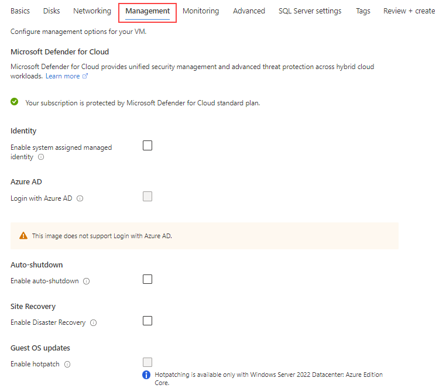
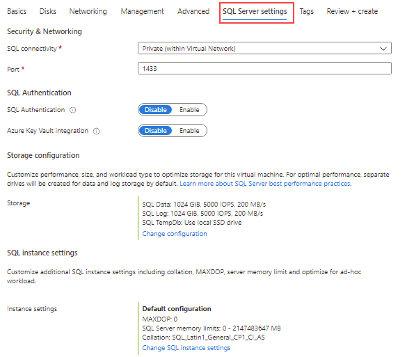
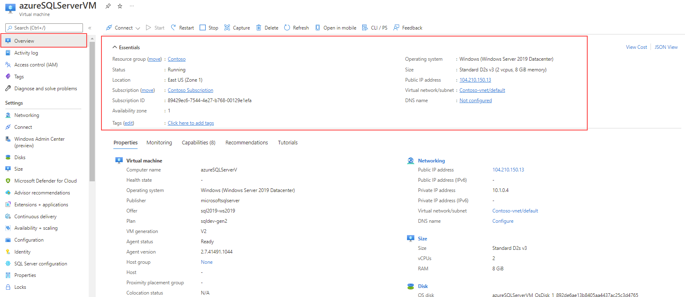
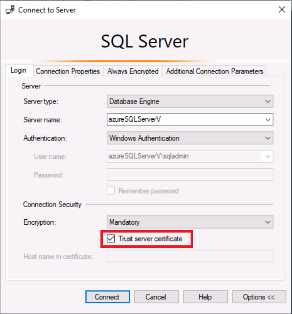

---
lab:
  title: 'Laboratório 1: provisionar o SQL Server em uma Máquina Virtual do Azure'
  module: Plan and Implement Data Platform Resources
---

# Provisionar um SQL Server em uma máquina virtual do Azure

**Tempo estimado**: 30 minutos

Os alunos vão explorar o Portal do Azure e usá-lo para criar uma VM do Azure com o SQL Server 2019 instalado. Em seguida, vão se conectar à máquina virtual por meio do Protocolo de Área de Trabalho Remota.

Você é um administrador de banco de dados da AdventureWorks. Você precisa criar um ambiente de teste para usar em uma prova de conceito. A prova de conceito usará o SQL Server em uma Máquina Virtual do Azure e um backup do banco de dados AdventureWorksDW. Você precisará configurar a Máquina Virtual, restaurar o banco de dados e consultá-lo para garantir que esteja disponível.

## Implantar o SQL Server em uma Máquina Virtual do Azure

1. Na máquina virtual do laboratório, inicie uma sessão do navegador, navegue até [https://portal.azure.com](https://portal.azure.com/) e faça login usando a conta Microsoft associada à sua assinatura do Azure.

    

1. Localize a barra de pesquisa na parte superior da página. Pesquise por **SQL do Azure**. Selecione o resultado da pesquisa do **SQL do Azure** que aparece nos resultados em **Serviços**.

    

1. Na folha do **SQL do Azure**, selecione **Criar**.

    

1. Na folha **Selecionar opção de implantação do SQL**, abra a caixa suspensa na guia **Máquinas virtuais do SQL**. Selecione a opção rotulada como **licença Gratuita do SQL Server: Desenvolvedor do SQL 2019 no Windows Server 2022**. Em seguida, selecione **Criar**.

    

1. Na página **Criar uma máquina virtual**, insira as seguintes informações:

    - **Assinatura**: &lt;Sua assinatura&gt;
    - **Grupo de recursos**: &lt;seu grupo de recursos&gt;
    - **Nome da máquina virtual:** azureSQLServerVM
    - **Região:** &lt;sua região local, a mesma região selecionada para o seu grupo de recursos&gt;
    - **Opções de Disponibilidade:** Sem necessidade de redundância de infraestrutura
    - **Imagem:** Licença Gratuita do SQL Server: Desenvolvedor do SQL 2019 no Windows Server 2022 — Gen1
    - **Instância de spot do Azure:** Não (desmarcada)
    - **Tamanho:** Padrão *D2s_v3* (2 vCPUs, 8 GiB de memória). Talvez você precise selecionar o link "Ver todos os tamanhos" para ver essa opção.
    - **Nome de usuário da conta de administrador:** sqladmin
    - **Senha da conta de administrador:** pwd!DP300lab01 (ou sua própria senha que atenda aos critérios)
    - **Selecionar as portas de entrada:** RDP (3389)
    - **Quer usar uma licença existente do Windows Server?** Não (desmarcada)

    Anote o nome de usuário e a senha para usar mais tarde.

    

1. Navegue até a guia **Discos** e examine a configuração.

    

1. Navegue até a guia **Rede** e examine a configuração.

    

1. Navegue até a guia **Gerenciamento** e examine a configuração.

    

    Verifique se **Habilitar auto_shutdown** está desmarcado.

1. Navegue até a guia **Avançado** e examine a configuração.

    

1. Navegue até a guia **Configurações do SQL Server** e examine a configuração.

    

    **Observação:** você também pode configurar o armazenamento para a sua VM do SQL Server nessa tela. Por padrão, os modelos de VM do SQL Server do Azure cria um disco premium com armazenamento em cache de leitura para dados e um disco premium sem armazenamento em cache para o log de transações, além de usar o SSD local (D:\ no Windows) para o tempdb.

1. Selecione o botão **Revisar + criar**. Em seguida, selecione **Criar**.

    

1. Na folha de implantação, aguarde até que a implantação seja concluída. A VM levará cerca de 5 a 10 minutos para ser implantada. Após a implantação ser concluída, selecione **Ir para o recurso**.

    **Observação:** sua implantação pode levar vários minutos para ser concluída.

    

1. Na página **Visão geral** da máquina virtual, explore as opções de menu para esse recurso e leia o que está disponível.

    

## Conectar-se ao SQL Server em uma Máquina Virtual do Azure

1. Na página **Visão geral** da máquina virtual, selecione o botão **Conectar** e escolha RDP.

    

1. Na guia do RDP, selecione o botão **Baixar Arquivo RDP**.

    

    **Observação:** se o erro **Pré-requisito de porta não atendido** aparecer, certifique-se de selecionar o link para adicionar uma regra de entrada do grupo de segurança de rede com a porta de destino mencionada no campo *Número da Porta*.

    

1. Abra o arquivo RDP que acabou de ser baixado. Quando uma caixa de diálogo aparecer perguntando se você quer se conectar, selecione **Conectar**.

    

1. Insira o nome de usuário e a senha selecionados durante o processo de provisionamento da máquina virtual. Em seguida, selecione **OK**.

    

1. Quando a caixa de diálogo **Conexão da Área de Trabalho Remota** aparecer, perguntando se você quer se conectar, selecione **Sim**.

    

1. Selecione o botão Iniciar do Windows e digite SSMS. Selecione **Microsoft SQL Server Management Studio** na lista.  

1. Quando o SSMS for aberto, observe que a caixa de diálogo **Conectar ao Servidor** será pré-preenchida com o nome de instância padrão. Selecione **Conectar**.

    

O portal do Azure fornece ferramentas poderosas para gerenciar um SQL Server hospedado em uma máquina virtual. Essas ferramentas incluem controle sobre aplicação de patch automatizada, backups automatizados e uma maneira fácil de configurar a alta disponibilidade.
