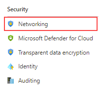

---
lab:
  title: 'Laboratório: provisionar um Banco de Dados SQL do Azure'
  module: Plan and Implement Data Platform Resources
---

# Provisionar um Banco de Dados SQL do Azure

**Tempo estimado**: 20 minutos

Os alunos configurarão os recursos básicos necessários para implantar um Banco de Dados SQL do Azure com um Ponto de Extremidade de Rede Virtual. A conectividade com o Banco de Dados SQL será validada usando o Azure Data Studio da VM de laboratório.

Como administrador de banco de dados, você configurará um novo Banco de Dados SQL do Azure, incluindo um Ponto de Extremidade de Rede Virtual para aumentar e simplificar a segurança da implantação. O Azure Data Studio será usado a fim de avaliar o uso de um Notebook SQL para consulta de dados e revisão dos resultados.

## Navegue até o portal do Azure.

1. Na máquina virtual do laboratório, inicie uma sessão do navegador e navegue até [https://portal.azure.com](https://portal.azure.com/). Conecte-se ao Portal usando o Nome** de Usuário e **a Senha** do Azure **fornecidos na **guia Recursos** para esta máquina virtual de laboratório.

    

1. No portal do Azure, procure "grupos de recursos" na caixa de pesquisa na parte superior e selecione **Grupos** de recursos na lista de opções.

    

1. **Na página Grupo de recursos, verifique o grupo de recursos listado (ele deve começar com *contoso-rg*), anote o Local** atribuído ao seu grupo de recursos**, pois você o **usará no próximo exercício.

    **Nota:** Você pode ter um local diferente atribuído.

    

## Criar uma rede virtual

1. No portal do Azure, no menu de navegação à esquerda, selecione Página Inicial.  

    

1. No painel de navegação esquerdo, clique em **Redes Virtuais**  

1. Clique em **Criar** para abrir a página **Criar uma rede virtual (clássica)**. Na guia **Básico**, complete as seguintes informações:

    - **Assinatura**: &lt;Sua assinatura&gt;
    - **Grupo de recursos:** começando com *contoso-rg*
    - **Nome:** lab02-vnet
    - **Localização:** selecione a mesma região em que o grupo de recursos foi criado

1. Clique em Rever + Criar, reveja as definições da nova rede virtual e, em seguida, clique em ****Criar****.

1. Configure o intervalo de IP da rede virtual para o ponto de extremidade do banco de dados SQL do Azure navegando até a rede virtual criada e, no **painel Configurações** , clique em **Sub-redes**.

1. Em Nome da sub-rede, clique no link padrão. Observe que o intervalo de endereços de **sub-rede** que você vê pode ser diferente.

1. No submenu Editar sub-rede, à direita, expanda a lista suspensa Serviços e marque Microsoft.Sql. Selecione **Salvar**.

## Provisionar um Banco de Dados SQL do Azure

1. Procure Banco de dados SQL na caixa de pesquisa na parte superior e selecione Banco de Dados SQL na lista de opções.

    

1. Na página **Bancos de Dados SQL**, selecione **+ Criar**.

    

1. **Na página Criar Banco de Dados** SQL, selecione as **seguintes opções na guia Noções básicas e clique em **Avançar**: Rede**.

    - **Assinatura**: &lt;Sua assinatura&gt;
    - **Grupo de recursos:** começando com *contoso-rg*
    - **Nome do banco de dados**: AdventureWorksLT
    - **Servidor:** clique em **Criar novo** link. A página do servidor de banco de dados será aberta. Forneça os detalhes do servidor da seguinte maneira:
        - Nome do servidor: azuresql-server-suas iniciais (minúsculas) (um nome de servidor deve ser exclusivo globalmente)
        - **Local:** &lt;sua região local, igual à região selecionada para seu grupo de recursos, caso contrário, ela pode falhar&gt;
        - **Método de autenticação**: use a autenticação do SQL.
        - Logon do administrador do servidor: dwdbadmin.
        - **Senha**: dp300P@ssword.
        - **Confirmar senha ***dp300P@ssword

        Sua **página Criar servidor do Banco de dados** SQL deve ser semelhante à página abaixo. Em seguida, clique em **OK**.

        

    -  De volta à página Criar Banco de Dados** SQL, verifique se **Deseja usar o **Pool Elástico?** está definido como **Não**.
    -  Na opção **Computação + armazenamento**, escolha **Configurar banco de dados**. Na página Configurar **, para **a **lista suspensa Camada** de serviço, selecione **Básico** e **Aplicar**.

    **Nota:** Anote este nome de servidor e suas informações de login. Você o usará em etapas subsequentes.

1. Para a opção Redundância de armazenamento de **backup, mantenha o valor padrão: **armazenamento** de backup com redundância** geográfica.

1. Clique em **Avançar: rede**.

1. **Na guia Rede**, na **opção Conectividade de Rede, clique no **botão de opção Ponto** de extremidade** privado.

    

1. Em seguida, selecione o link Adicionar ponto de extremidade privado em Pontos de Extremidade Privados

    

1. Conclua o painel direito Criar **ponto de extremidade** privado da seguinte maneira:

    - **Assinatura**: &lt;Sua assinatura&gt;
    - **Grupo de recursos:** começando com *contoso-rg*
    - **Local:** &lt;sua região local, igual à região selecionada para seu grupo de recursos, caso contrário, ela pode falhar&gt;
    - **Nome:** DP-300-SQL-Endpoint
    - Sub-recurso de destino: SqlServer
    - **Rede virtual (VNet)**
    - **Sub-rede:** lab02-vnet/default (10.x.0.0/24)
    - **Integrar com a zona DNS privada**: sim
    - **Zona DNS privada:** mantenha o valor padrão
    - Examine as configurações e clique em **OK**.  

    

1. O novo ponto de extremidade será listado na página **Pontos de extremidade** .

    

1. Clique em Avançar: Segurança** e, em seguida, em ****Avançar: Configurações** adicionais.  

1. Na guia **Configurações adicionais**, selecione **Amostra** para **Usar dados existentes**. Selecione **OK** se uma mensagem pop-up for exibida para o banco de dados de exemplo.

    

1. Clique em **Examinar + Criar**.

1. Examine as configurações e clique em **Criar**.

1. Quando a implantação estiver concluída, clique em **Ir para o recurso**.

## Acesso a um Banco de dados SQL do Azure.

1. Na página Banco de **dados** SQL, selecione a **seção Visão geral** e selecione o link para o nome do servidor na seção superior:

    

1. Na folha de navegação SQL servers, selecione **Rede na **seção Segurança****.

    

1. **Na guia Acesso público**, selecione **Redes** selecionadas e marque a propriedade Permitir que os serviços e recursos do **Azure acessem este servidor**. Clique em **Save** (Salvar).

    

## Conectar-se a um Banco de Dados SQL do Azure usando o Azure Data Studio

1. Inicie o Azure Data Studio a partir da máquina virtual de laboratório.

    - Você pode ver esse pop-up na inicialização inicial do Azure Data Studio. Se você recebê-lo, clique em **Sim (recomendado)**  

        

1. Quando o Azure Data Studio for aberto, clique no **botão Conexões** no canto superior esquerdo e em **Adicionar Conexão**.

    

1. Na barra lateral **Conexão**, preencha a seção **Detalhes da Conexão** com as informações para a conexão ao banco de dados AdventureWorksLT criado nas etapas anteriores.

    - Tipo de Conexão: **Microsoft SQL Server**
    - Ema Nome do SQL Server, insira o nome do SQL Server que você criou. Por exemplo: **dp300-lab-xxxxxxxx.database.windows.net** (Onde 'xxxxxxxx' é um número de ramdom)
    - Tipo de Autenticação: **Logon do SQL**
    - Nome de usuário: **dp300admin**
    - Senha: **dp300P@ssword!**
    - Expanda a lista suspensa Banco de dados para selecionar **AdventureWorksLT** 
        - **Observação :** você pode ser solicitado a adicionar uma regra de firewall que permite o acesso IP do cliente a este servidor. Se lhe for pedido para adicionar uma regra de firewall, clique em Adicionar conta e inicie sessão na **sua conta** do Azure. Na **tela Criar nova regra de** firewall, clique em **OK.**

        

        Como alternativa, você pode criar manualmente uma regra de firewall para seu SQL Server no portal do Azure navegando até o SQL Server, selecionando Rede** e selecionando ****+ Adicionar o endereço IPv4 do cliente (seu endereço IP)**

        

    De volta à barra lateral Conexão, continue preenchendo os detalhes da conexão:  

    - O grupo de servidores permanecerá o **&lt;padrão&gt;**.
    - O Nome (opcional) pode ser preenchido com um nome amigável do banco de dados, se desejado.
    - Revise as configurações e clique em **Conectar**  

    

1. O ADS se conectará ao banco de dados e mostrará algumas informações básicas sobre o banco, incluindo uma lista parcial de objetos.

    

## Consultar o Banco de Dados SQL do Azure com um Notebook SQL

1. No Azure Data Studio, conectado ao banco de dados AdventureWorksLT deste laboratório, clique no **botão Novo Bloco de Anotações** .

    

1. Clique no **link +Texto** para adicionar uma nova caixa de texto no bloco de anotações  

    

No notebook, você pode inserir texto sem formatação para explicar consultas ou conjuntos de resultados.

1. Insira o texto **Dez Principais Clientes por Subtotal de Pedidos**.

    

1. Clique no botão + Célula** e, em seguida **, em Célula** de código para adicionar uma nova célula de código no **final do bloco de notas.  

    

5. Cole a instrução SQL a seguir na nova célula.

```sql
SELECT TOP 10 cust.[CustomerID], 
    cust.[CompanyName], 
    SUM(sohead.[SubTotal]) as OverallOrderSubTotal
FROM [SalesLT].[Customer] cust
    INNER JOIN [SalesLT].[SalesOrderHeader] sohead
         ON sohead.[CustomerID] = cust.[CustomerID]
GROUP BY cust.[CustomerID], cust.[CompanyName]
ORDER BY [OverallOrderSubTotal] DESC
   ```

1. Selecione o círculo azul com a seta para executar a consulta. Observe como os resultados são incluídos na célula com a consulta.

1. Clique no **botão + Texto** para adicionar uma nova célula de texto.

1. Digite o texto **Top Ten Ordered Product Categories**, tornando-o Ousado, se desejado.

1. Selecione **+ Código** novamente para adicionar uma nova célula e cole a instrução SQL a seguir na célula.

```sql
SELECT TOP 10 cat.[Name] AS ProductCategory, 
    SUM(detail.[OrderQty]) AS OrderedQuantity
FROM salesLT.[ProductCategory] cat
   INNER JOIN [SalesLT].[Product] prod
      ON prod.[ProductCategoryID] = cat.[ProductCategoryID]
   INNER JOIN [SalesLT].[SalesOrderDetail] detail
      ON detail.[ProductID] = prod.[ProductID]
GROUP BY cat.[name]
ORDER BY [OrderedQuantity] DESC
```

1. Selecione o círculo azul com a seta para executar a consulta.

1. Para executar todas as células no notebook e apresentar os resultados, selecione o botão **Executar Células** na barra de ferramentas.

    

1. No Azure Data Studio, salve o bloco de anotações no menu Arquivo (Salvar ou Salvar como) no **caminho C:\Labfiles\Deploy do Banco de Dados SQL do** Azure (crie a estrutura de pastas se ela não existir). (Certifique-se de que a extensão de arquivo seja .)

1. Feche a guia do Bloco de Anotações de dentro do Azure Data Studio. No menu Arquivo, selecione Abrir Arquivo e abra o notebook que você acabou de salvar. Observe que os resultados da consulta foram salvos com as consultas no notebook.

Neste exercício, você viu como implantar um Banco de Dados SQL do Azure com um Ponto de Extremidade de Rede Virtual. Você também conseguiu se conectar ao Banco de Dados SQL criado usando o SQL Server Management Studio.
