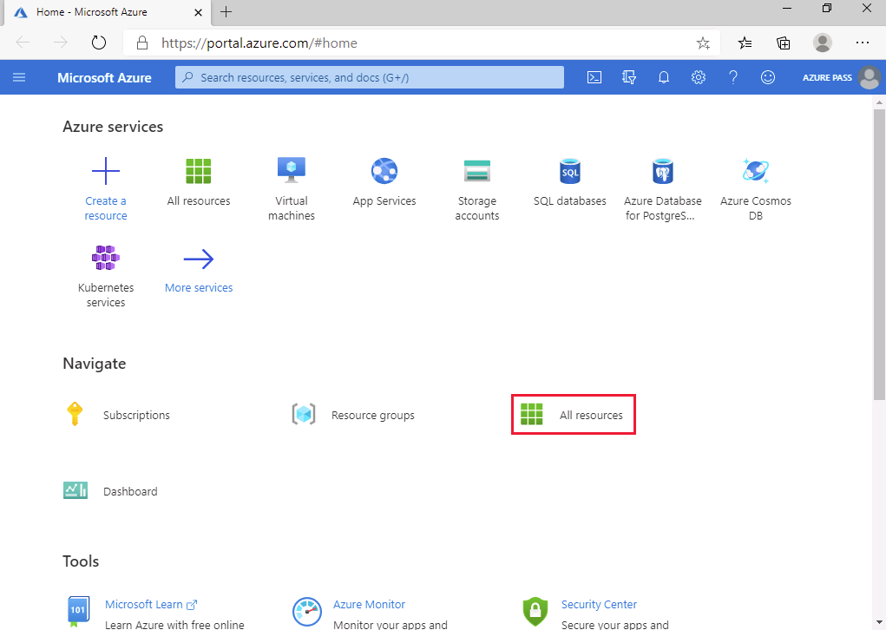
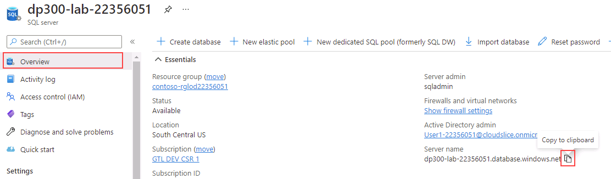
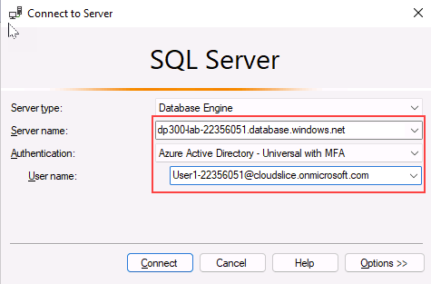

---
lab:
  title: Laboratório 3 – autorizar o acesso ao Banco de Dados SQL do Azure com o Azure Active Directory
  module: Implement a Secure Environment for a Database Service
---

# Configurar a autenticação e autorização do banco de dados

**Tempo estimado**: 20 minutos

Os alunos usarão as informações obtidas nas lições para configurar e, posteriormente, implementar a segurança no Portal do Azure e no banco de dados do *AdventureWorks*.

Você foi contratado como um Administrador de Banco de Dados Sênior para ajudar a garantir a segurança do ambiente de banco de dados.

**Observação:** Esses exercícios podem solicitar que você copie e cole código T-SQL e use recursos SQL existentes. Verifique se o código foi copiado corretamente antes de executá-lo.

## Autorizar o acesso ao Banco de Dados SQL do Azure com o Azure Active Directory

1. Na máquina virtual do laboratório, inicie uma sessão do navegador e navegue até [https://portal.azure.com](https://portal.azure.com/). Conecte-se ao Portal usando o **Nome de Usuário** e a **Senha** do Azure fornecidos na guia **Recursos** dessa máquina virtual do laboratório.

    

1. Na página inicial do portal do Azure, selecione **Todos os recursos**.

    

1. Selecione o SQL server **dp300-lab-xxxxxx**, em que **xxxxxx** é uma cadeia de caracteres aleatória, e selecione **Não Configurado** ao lado de **Administrador do Active Directory**.

    

1. Na próxima tela, selecione **Definir administrador**.

    

1. Na barra lateral do **Azure Active Directory**, procure o nome de usuário do Azure com o qual você fez logon no portal do Azure e clique em **Selecionar**.

1. Selecione **Salvar** para concluir o processo. Isso fará com que o nome de usuário seja o administrador do Azure Active Directory para o servidor, conforme mostrado abaixo.

    

1. À esquerda, selecione **Visão geral** e copie o **Nome do servidor**.

    

1. Abra o SQL Server Management Studio e selecione **Conectar** > **Mecanismo de Banco de Dados**. Na pasta **Nome do servidor**, digite o nome do servidor. Altere o tipo de autenticação para **Azure Active Directory Universal com MFA**.

    

    No campo **Nome de usuário**, selecione o **Nome de usuário** do Azure na guia **Recursos**.

1. Selecione **Conectar**.

> [!NOTE]
> Quando você tenta entrar em um banco de dados SQL do Azure pela primeira vez, o endereço IP do cliente precisa ser adicionado ao firewall. O SQL Server Management Studio pode fazer isso para você. Use a **senha** do portal do Azure na guia **Recursos** e, em seguida, selecione **Entrar**, escolha as credenciais do Azure e selecione **OK**.
> 

## Gerenciar o acesso a objetos do banco de dados

Nesta tarefa, você gerenciará o acesso ao banco de dados e a seus objetos. Primeiramente, crie dois usuários no banco de dados *AdventureWorksLT*.

1. Use o **Pesquisador de Objetos** e expanda **Bancos de Dados**.
1. Clique com o botão direito do mouse em **AdventureWorksLT** e selecione **Nova Consulta**.

    

1. Na janela Nova consulta, copie e cole o T-SQL abaixo. Execute a consulta para criar os dois usuários.

    ```sql
    CREATE USER [DP300User1] WITH PASSWORD = 'Azur3Pa$$';
    GO

    CREATE USER [DP300User2] WITH PASSWORD = 'Azur3Pa$$';
    GO
    ```

    **Observação:** Observe que esses usuários são criados no escopo do banco de dados AdventureWorksLT. Em seguida, crie uma função personalizada e adicione os usuários a ela.

1. Execute o T-SQL a seguir na mesma janela de consulta.

    ```sql
    CREATE ROLE [SalesReader];
    GO

    ALTER ROLE [SalesReader] ADD MEMBER [DP300User1];
    GO

    ALTER ROLE [SalesReader] ADD MEMBER [DP300User2];
    GO
    ```

    Em seguida, crie um novo procedimento armazenado no esquema **SalesLT**.

1. Execute o T-SQL abaixo na janela Consulta.

    ```sql
    CREATE OR ALTER PROCEDURE SalesLT.DemoProc
    AS
    SELECT P.Name, Sum(SOD.LineTotal) as TotalSales ,SOH.OrderDate
    FROM SalesLT.Product P
    INNER JOIN SalesLT.SalesOrderDetail SOD on SOD.ProductID = P.ProductID
    INNER JOIN SalesLT.SalesOrderHeader SOH on SOH.SalesOrderID = SOD.SalesOrderID
    GROUP BY P.Name, SOH.OrderDate
    ORDER BY TotalSales DESC
    GO
    ```

    Em seguida, use a sintaxe `EXECUTE AS USER` para testar a segurança. Isso permite que o mecanismo de banco de dados execute uma consulta no contexto do usuário.

1. Execute o T-SQL a seguir.

    ```sql
    EXECUTE AS USER = 'DP300User1'
    EXECUTE SalesLT.DemoProc
    ```

    Ocorrerá uma falha com a mensagem:

    

1. Em seguida, conceda permissões à função para possibilitar que ela execute o procedimento armazenado. Execute o T-SQL abaixo.

    ```sql
    REVERT;
    GRANT EXECUTE ON SCHEMA::SalesLT TO [SalesReader];
    GO
    ```

    O primeiro comando reverte o contexto de execução para o proprietário do banco de dados.

1. Reexecute o T-SQL anterior.

    ```sql
    EXECUTE AS USER = 'DP300User1'
    EXECUTE SalesLT.DemoProc
    ```

    

Neste exercício, você viu como pode usar o Azure Active Directory para conceder acesso às credenciais do Azure a um SQL Server hospedado no Azure. Você também usou a instrução T-SQL para criar novos usuários de banco de dados e concedeu a eles permissões para executar procedimentos armazenados.
