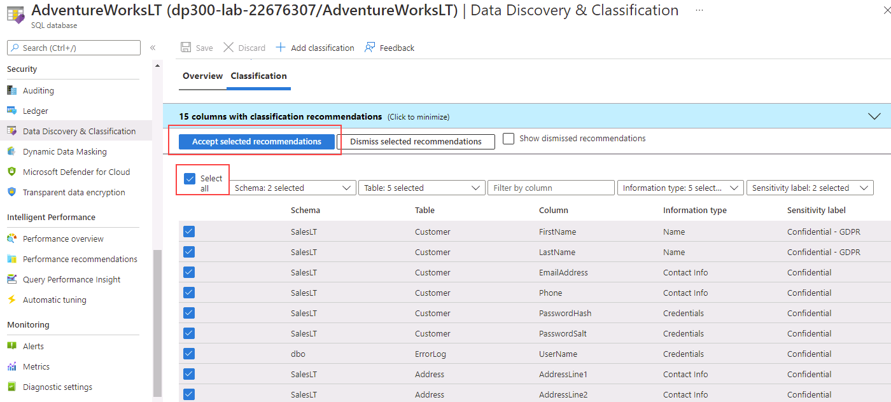
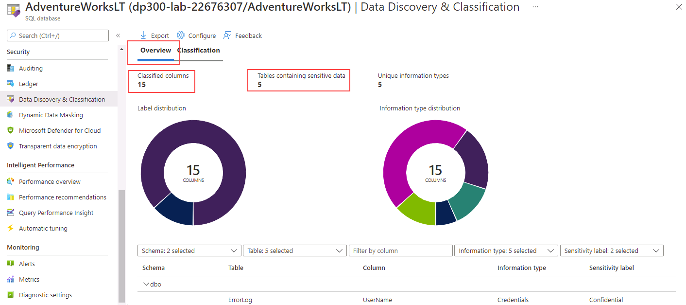

---
lab:
  title: 'Laboratório: habilitar o Microsoft Defender para SQL e a Classificação de Dados'
  module: Implement a Secure Environment for a Database Service
---

# Laboratório: habilitar o Microsoft Defender para SQL e a Classificação de Dados

**Tempo estimado**: 20 minutos

Os alunos pegarão as informações obtidas nas lições para configurar e, posteriormente, implementar a segurança no Portal do Azure e no banco de dados AdventureWorks.

Você foi contratado como um Administrador de Banco de Dados Sênior para ajudar a garantir a segurança do ambiente de banco de dados. Essas tarefas se concentrarão no Banco de Dados SQL do Azure.

## Habilitar o Microsoft Defender para SQL

1. Na máquina virtual do laboratório, inicie uma sessão do navegador e navegue até [https://portal.azure.com](https://portal.azure.com/). Conecte-se ao Portal usando o Nome** de Usuário e **a Senha** do Azure **fornecidos na **guia Recursos** para esta máquina virtual de laboratório.

    

1. No Portal do Azure, procure "SQL servers" na caixa de pesquisa na parte superior e clique em **SQL servers** na lista de opções.

    

1. Selecione o nome **do servidor dp300-lab-XXXXXXXX** a ser levado para a página de detalhes (você pode ter um grupo de recursos e um local diferentes atribuídos ao seu SQL Server).

    

1. No painel principal do servidor SQL do Azure, navegue até a seção **Segurança** e selecione **Microsoft Defender para Nuvem**.

    

    Na página **Microsoft Defender para Nuvem**, selecione **Habilitar o Microsoft Defender para SQL**.

1. A mensagem de notificação a seguir será exibida depois que o Azure Defender para SQL for habilitado com êxito.

    

1. Na página Microsoft **Defender para Nuvem** , selecione o **link Configurar** (talvez seja necessário atualizar a página para ver essa opção)

    

1. Na página Configurações** do servidor, observe que a **opção de alternância em **MICROSOFT DEFENDER FOR SQL** está definida como **ON.**

## Habilitar a classificação de Dados

1. Na folha principal do servidor SQL do Azure, navegue até a **seção Configurações** , selecione bancos de dados SQL e selecione **o nome do banco de dados**.

    

1. Navegue até a seção Segurança da folha principal do Banco de Dados SQL do Azure e selecione Descoberta e classificação de dados.

    

1. Na tela **Descoberta e Classificação de Dados**, você verá a seguinte mensagem informativa: **Foram encontradas 15 colunas com recomendações de classificação**. Selecione esse link.

    

1. Na tela **Descoberta e Classificação de Dados**, marque a caixa de seleção ao lado de **Selecionar tudo**, selecione **Recomendações selecionadas aceitas** e **Salvar** para salvar as classificações no banco de dados.

    

1. De volta à **tela Data Discovery & Classification** , observe que quinze colunas foram classificadas com êxito em cinco tabelas diferentes.

    

Neste exercício, você aprimorou a segurança de um Banco de Dados SQL do Azure habilitando o Microsoft Defender para SQL. Você também criou colunas classificadas com base nas recomendações do portal do Azure.
