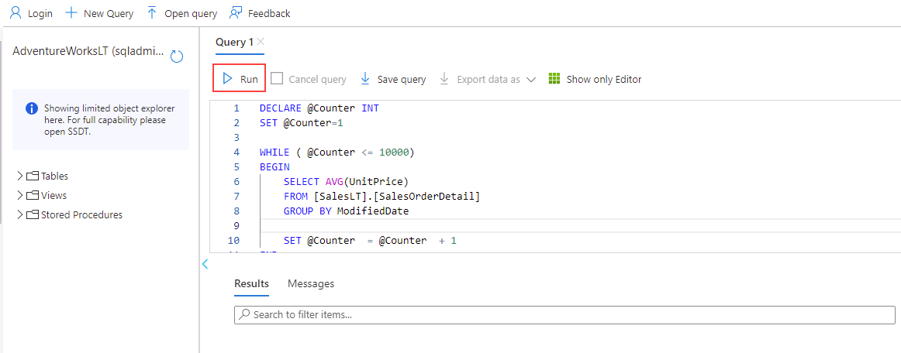

---
lab:
  title: 'Laboratório 6: isolar problemas de desempenho por meio do monitoramento'
  module: Monitor and optimize operational resources in Azure SQL
---

# Isolar problemas de desempenho por meio do monitoramento

**Tempo estimado**: 30 minutos

Os alunos levarão as informações obtidas nas aulas para definir o escopo das entregas para um projeto de transformação digital no AdventureWorks. Examinando o portal do Azure, bem como outras ferramentas, os alunos determinarão como utilizar ferramentas para identificar e resolver problemas relacionados ao desempenho.

Você foi contratado como administrador de banco de dados para identificar problemas relacionados ao desempenho e fornecer soluções viáveis para solucionar todos os problemas encontrados. Você precisa usar o portal do Azure para identificar os problemas de desempenho e sugerir métodos para resolvê-los.

**Observação:** Esses exercícios solicitam que você copie e cole o código T-SQL e use os recursos existentes do SQL. Verifique se o código foi copiado corretamente antes de executá-lo.

## Examinar a utilização da CPU no portal do Azure

1. Na máquina virtual do laboratório, inicie uma sessão do navegador e navegue até [https://portal.azure.com](https://portal.azure.com/). Conecte-se ao Portal usando o **Nome de Usuário** e a **Senha** do Azure fornecidos na guia **Recursos** dessa máquina virtual do laboratório.

    

1. No Portal do Azure, pesquise por "servidores SQL" na caixa de pesquisa na parte superior e clique em **servidores SQL** na lista de opções.

    

1. Selecione o nome do servidor **dp300-lab-XXXXXXXXX** a ser levado para a página de detalhes (você pode ter um grupo de recursos e um local diferentes atribuídos ao seu servidor SQL).

    

1. Na folha principal do servidor do SQL do Azure, navegue até a seção **Configurações** e selecione **bancos de dados SQL** e selecione o nome do banco de dados.

    

1. Na página principal do banco de dados, selecione **Definir firewall do servidor**.

    

1. Na página **Rede**, selecione **+ Adicionar o endereço IPv4 do cliente (seu endereço IP)** e, em seguida, selecione **Salvar**.

    

1. Na navegação acima de **Rede**, selecione o link que começa com **AdventureWorksLT**.

    

1. Na barra de navegação esquerda, escolha **Editor de consultas (versão prévia)**.

    

    **Observação:** Esta funcionalidade está em versão prévia.

1. Em **Senha**, digite ****P@ssw0rd01 e selecione **OK**.

    

1. Em **Consulta 1**, digite a consulta a seguir e escolha **Executar**:

    ```sql
    DECLARE @Counter INT 
    SET @Counter=1
    WHILE ( @Counter <= 10000)
    BEGIN
        SELECT 
             RTRIM(a.Firstname) + ' ' + RTRIM(a.LastName)
            , b.AddressLine1
            , b.AddressLine2
            , RTRIM(b.City) + ', ' + RTRIM(b.StateProvince) + '  ' + RTRIM(b.PostalCode)
            , CountryRegion
            FROM SalesLT.Customer a
            INNER JOIN SalesLT.CustomerAddress c 
                ON a.CustomerID = c.CustomerID
            RIGHT OUTER JOIN SalesLT.Address b
                ON b.AddressID = c.AddressID
        ORDER BY a.LastName ASC
        SET @Counter  = @Counter  + 1
    END
    ```

    

1. Aguarde a conclusão da consulta.

1. Na folha do banco de dados **AdventureWorksLT**, selecione o ícone **Métricas**na seção **Monitoramento**.

    

1. Altere a opção de menu **Métrica** para refletir a **Porcentagem de CPU** e, em seguida, selecione uma **Agregação** de **média**. Isso mostrará a porcentagem média da CPU para o período escolhido.

    

1. Observe a média da CPU ao longo do tempo. Você pode ter resultados ligeiramente diferentes. Como alternativa, você pode executar a consulta várias vezes para obter resultados mais substanciais.

    

## Identificar consultas de alto consumo de CPU

1. Encontre o ícone de **Análise de Desempenho de Consultas** na seção **Desempenho Inteligente** da folha do banco de dados **AdventureWorksLT**.

    

1. Escolha **Redefinir configurações**.

    

1. Clique na consulta na grade abaixo do gráfico. Se você não vir uma consulta, aguarde 2 minutos e escolha **Atualizar**.

    **Observação:** Você pode ter uma duração e uma ID de consulta diferentes. Se você vir mais de uma consulta, clique em cada uma para observar os resultados.

    

Para essa consulta, você pode ver que a duração total foi de mais de 1 minuto e que ela foi executada aproximadamente 10.000 vezes.

Neste exercício, você aprendeu a explorar os recursos do servidor para um Banco de Dados SQL do Azure e identificar possíveis problemas de desempenho de consulta por meio da Análise de Desempenho de Consultas.
