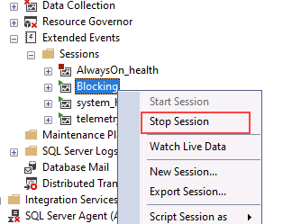

---
lab:
  title: 'Laboratório: identificar e resolver problemas de bloqueio'
  module: Optimize query performance in Azure SQL
---

# Laboratório: identificar e resolver problemas de bloqueio

**Tempo estimado**: 15 minutos

Os alunos levarão as informações obtidas nas aulas para definir o escopo dos resultados de um projeto de transformação digital dentro da AdventureWorks. Examinando o portal do Azure, bem como outras ferramentas, os alunos determinarão como utilizar ferramentas nativas para identificar e resolver problemas relacionados ao desempenho. Finalmente, os alunos serão capazes de identificar e resolver problemas de bloqueio adequadamente.

Você foi contratado como administrador de banco de dados para identificar problemas relacionados ao desempenho e fornecer soluções viáveis para solucionar todos os problemas encontrados. Você precisa investigar os problemas de desempenho e sugerir métodos para resolvê-los.

**Nota:** Estes exercícios pedem que você copie e cole o código T-SQL. Verifique se o código foi copiado corretamente, antes de executar o código.

## Restaurar um banco de dados

1. Faça download do arquivo de backup do banco de dados localizado em ****https://github.com/MicrosoftLearning/dp-300-database-administrator/blob/master/Instructions/Templates/AdventureWorks2017.bak** C:\LabFiles\Monitor e otimize** o caminho na máquina virtual do laboratório (crie a estrutura de pastas se ela não existir).

    

1. Selecione o botão Iniciar do Windows e digite SSMS. Selecione **Microsoft SQL Server Management Studio 18** na lista.  

    

1. Quando o SSMS for aberto, observe que a caixa de diálogo Conectar ao Servidor** será pré-preenchida com o **nome de instância padrão. Selecione **Conectar**.

    

1. Selecione a **pasta Bancos de Dados** e Nova **Consulta**.

    

1. Na janela Nova consulta, copie e cole o T-SQL abaixo. Execute a consulta para restaurar o banco de dados.

    ```sql
    RESTORE DATABASE AdventureWorks2017
    FROM DISK = 'C:\LabFiles\Monitor and optimize\AdventureWorks2017.bak'
    WITH RECOVERY,
          MOVE 'AdventureWorks2017' 
            TO 'C:\LabFiles\Monitor and optimize\AdventureWorks2017.mdf',
          MOVE 'AdventureWorks2017_log'
            TO 'C:\LabFiles\Monitor and optimize\AdventureWorks2017_log.ldf';
    ```

    **Nota:** O nome e o caminho do arquivo de backup do banco de dados devem corresponder ao que você baixou na etapa 1, caso contrário, o comando falhará.

1. Você verá uma mensagem bem-sucedida após a conclusão da restauração.

    

## Executar um relatório de consultas bloqueadas

1. Selecione **Nova Consulta**. Copie e cole o código T-SQL abaixo na janela de consulta. Clique em **Executar** para executar esta consulta.

    ```sql
    USE MASTER

    GO

    CREATE EVENT SESSION [Blocking] ON SERVER 
    ADD EVENT sqlserver.blocked_process_report(
    ACTION(sqlserver.client_app_name,sqlserver.client_hostname,sqlserver.database_id,sqlserver.database_name,sqlserver.nt_username,sqlserver.session_id,sqlserver.sql_text,sqlserver.username))
    ADD TARGET package0.ring_buffer
    WITH (MAX_MEMORY=4096 KB, EVENT_RETENTION_MODE=ALLOW_SINGLE_EVENT_LOSS, MAX_DISPATCH_LATENCY=30 SECONDS, MAX_EVENT_SIZE=0 KB,MEMORY_PARTITION_MODE=NONE, TRACK_CAUSALITY=OFF,STARTUP_STATE=ON)
    GO

    -- Start the event session 
    ALTER EVENT SESSION [Blocking] ON SERVER 
    STATE = start; 
    GO
    ```

    O código T-SQL mostrado acima criará uma sessão de Evento Estendido que vai capturar eventos de bloqueio. Os dados conterão os seguintes elementos:

    - Nome do aplicativo cliente
    - O nome do host do cliente
    - ID do banco de dados
    - Nome do banco de dados
    - Nome de usuário do NT
    - ID da Sessão
    - Texto do T-SQL
    - Nome de Usuário

1. Selecione **Nova Consulta**. Copie e cole o código T-SQL abaixo na janela de consulta. Clique em **Executar** para executar esta consulta.

    ```sql
    EXEC sys.sp_configure N'show advanced options', 1
    RECONFIGURE WITH OVERRIDE;
    GO
    EXEC sp_configure 'blocked process threshold (s)', 60
    RECONFIGURE WITH OVERRIDE;
    GO
    ```

    O limite, em segundos, no qual os relatórios de processos bloqueados são gerados. Como resultado, não somos obrigados a esperar tanto tempo para que a blocked_process_report* seja levantada *nesta lição.

1. Selecione **Nova Consulta**. Copie e cole o código T-SQL abaixo na janela de consulta. Clique em **Executar** para executar esta consulta.

    ```sql
    USE AdventureWorks2017
    GO

    BEGIN TRANSACTION
        UPDATE Person.Person 
        SET LastName = LastName;

    GO
    ```

1. Abra outra janela de consulta clicando no botão **Nova Consulta**. Copie e cole o código T-SQL abaixo na janela de consulta. Clique em **Executar** para executar esta consulta.

    ```sql
    USE AdventureWorks2017
    GO

    SELECT TOP (1000) [LastName]
      ,[FirstName]
      ,[Title]
    FROM Person.Person
    WHERE FirstName = 'David'
    ```

    **Nota:** esta consulta não retorna nenhum resultado e parece ser executada indefinidamente.

1. No Pesquisador de Objetos, expanda Gerenciamento, Eventos Estendidos e, em seguida, Sessões.

    Observe que o evento estendido chamado Bloqueio* que *acabamos de criar está na lista.

    

1. Clique com o botão direito do mouse em package0.ring_buffer, depois clique em Exibir Dados de Destino.

    

1. Clique no hiperlink.

    

1. O arquivo XML mostrará quais processos estão sendo bloqueados e qual processo está causando o bloqueio. Será possível conferir as consultas que foram executadas nesse processo, bem como informações do sistema.

    

1. Essa consulta também pode ser usada para identificar sessões que bloqueiam outras sessões, incluindo uma lista de session_ids bloqueadas por session_id.

    ```sql
    WITH cteBL (session_id, blocking_these) AS 
    (SELECT s.session_id, blocking_these = x.blocking_these FROM sys.dm_exec_sessions s 
    CROSS APPLY    (SELECT isnull(convert(varchar(6), er.session_id),'') + ', '  
                    FROM sys.dm_exec_requests as er
                    WHERE er.blocking_session_id = isnull(s.session_id ,0)
                    AND er.blocking_session_id <> 0
                    FOR XML PATH('') ) AS x (blocking_these)
    )
    SELECT s.session_id, blocked_by = r.blocking_session_id, bl.blocking_these
    , batch_text = t.text, input_buffer = ib.event_info, * 
    FROM sys.dm_exec_sessions s 
    LEFT OUTER JOIN sys.dm_exec_requests r on r.session_id = s.session_id
    INNER JOIN cteBL as bl on s.session_id = bl.session_id
    OUTER APPLY sys.dm_exec_sql_text (r.sql_handle) t
    OUTER APPLY sys.dm_exec_input_buffer(s.session_id, NULL) AS ib
    WHERE blocking_these is not null or r.blocking_session_id > 0
    ORDER BY len(bl.blocking_these) desc, r.blocking_session_id desc, r.session_id;
    ```

    

1. Clique com o botão direito do mouse no evento estendido chamado **Bloqueio e selecione **Parar Sessão****.

    

1. Navegue de volta para a sessão de consulta que está causando o bloqueio e digite `ROLLBACK TRANSACTION` na linha abaixo da consulta. Realce `ROLLBACK TRANSACTION`e selecione **Executar**.

    

1. Navegue de volta para a sessão de consulta que estava sendo bloqueada. Você observará que a consulta já foi concluída.

    

## Habilitar nível de isolamento do instantâneo da confirmação de leitura

1. Clique no botão **Nova Consulta** do SQL Server Management Studio. Copie e cole o código T-SQL abaixo na janela de consulta. Clique no botão **Executar** para executar esta consulta.

    ```sql
    USE master
    GO
    
    ALTER DATABASE AdventureWorks2017 SET READ_COMMITTED_SNAPSHOT ON WITH ROLLBACK IMMEDIATE;
    GO
    ```

1. Execute novamente a consulta que causou o bloqueio em um novo editor de consultas.

    ```sql
    USE AdventureWorks2017
    GO
    
    BEGIN TRANSACTION
        UPDATE Person.Person 
        SET LastName = LastName;
    GO
    ```

1. Execute novamente a consulta que estava sendo bloqueada em um novo editor de consultas.

    ```sql
    USE AdventureWorks2017
    GO
    
    SELECT TOP (1000) [LastName]
     ,[FirstName]
     ,[Title]
    FROM Person.Person
    WHERE firstname = 'David'
    ```

    

    Considere por que a consulta da Etapa 3 agora foi concluída, enquanto na tarefa anterior ela foi bloqueada pelo comando UPDATE.

    O isolamento de instantâneo de leitura confirmada é uma forma otimista de isolamento de transação. Além disso, a última consulta mostrará a versão confirmada e mais recente dos dados, em vez de ser bloqueada.

Neste exercício, você aprendeu a identificar sessões que estão sendo bloqueadas e a mitigar esses cenários.
