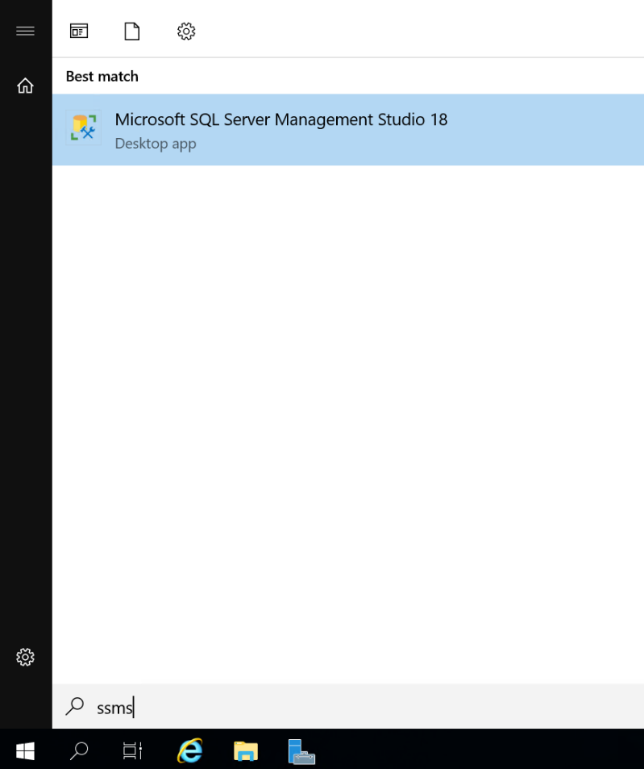
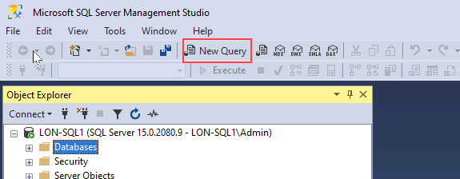
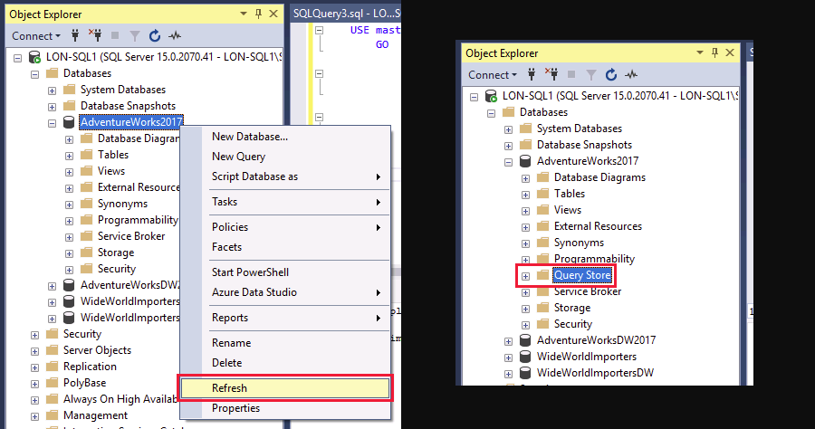
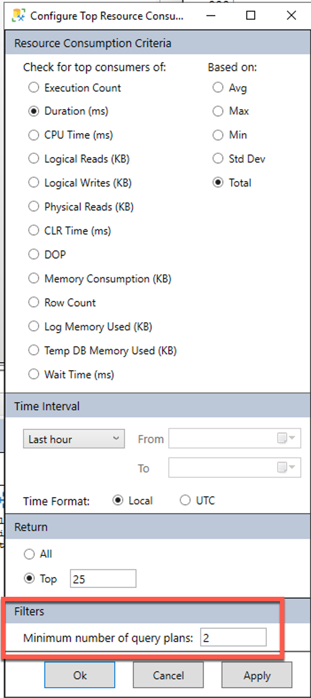
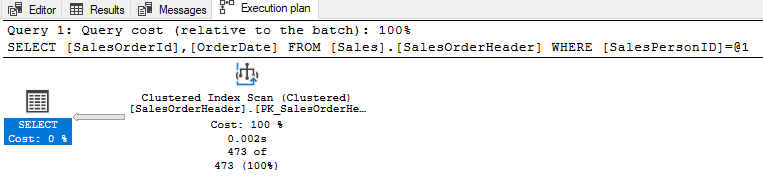

---
lab:
  title: 'Laboratório: isolar áreas problemáticas em consultas com baixo desempenho em um Banco de Dados SQL'
  module: Optimize query performance in Azure SQL
---

# Laboratório: isolar áreas problemáticas em consultas com baixo desempenho em um Banco de Dados SQL

**Tempo estimado**: 20 minutos

Você foi contratado como administrador de banco de dados sênior para ajudar com problemas de desempenho que têm ocorrido quando os usuários consultam o banco de dados AdventureWorks2017. Seu trabalho é identificar problemas no desempenho das consultas e resolvê-los usando as técnicas aprendidas neste módulo.

Você executará consultas com desempenho inferior, examinará os planos de consulta e tentará fazer melhorias no banco de dados AdventureWorks2017.

**Nota:** Estes exercícios pedem que você copie e cole o código T-SQL. Verifique se o código foi copiado corretamente, antes de executar o código.

## Restaurar um banco de dados

1. Faça download do arquivo de backup do banco de dados localizado em ****https://github.com/MicrosoftLearning/dp-300-database-administrator/blob/master/Instructions/Templates/AdventureWorks2017.bak** C:\LabFiles\Monitor e otimize** o caminho na máquina virtual do laboratório (crie a estrutura de pastas se ela não existir).

    

1. Selecione o botão Iniciar do Windows e digite SSMS. Selecione **Microsoft SQL Server Management Studio 18** na lista.  

    

1. Quando o SSMS for aberto, observe que a caixa de diálogo Conectar ao Servidor** será pré-preenchida com o **nome de instância padrão. Selecione **Conectar**.

    

1. Selecione a **pasta Bancos de Dados** e Nova **Consulta**.

    

1. Na janela Nova consulta, copie e cole o T-SQL abaixo. Execute a consulta para restaurar o banco de dados.

    ```sql
    RESTORE DATABASE AdventureWorks2017
    FROM DISK = 'C:\LabFiles\Monitor and optimize\AdventureWorks2017.bak'
    WITH RECOVERY,
          MOVE 'AdventureWorks2017' 
            TO 'C:\LabFiles\Monitor and optimize\AdventureWorks2017.mdf',
          MOVE 'AdventureWorks2017_log'
            TO 'C:\LabFiles\Monitor and optimize\AdventureWorks2017_log.ldf';
    ```

    **Nota:** O nome e o caminho do arquivo de backup do banco de dados devem corresponder ao que você baixou na etapa 1, caso contrário, o comando falhará.

1. Você verá uma mensagem bem-sucedida após a conclusão da restauração.

    

## Gerar plano de execução real

Há várias maneiras de gerar um plano de execução no SQL Server Management Studio.

1. Selecione **Nova Consulta**. Copie e cole o código T-SQL abaixo na janela de consulta. Clique em **Executar** para executar esta consulta.

    Use a configuração SHOWPLAN_ALL para ver uma versão em texto do plano de execução da consulta no painel de resultados, em vez de graficamente em uma guia separada.

    ```sql
    USE AdventureWorks2017;
    GO

    SET SHOWPLAN_ALL ON;
    GO

    SELECT BusinessEntityID
    FROM HumanResources.Employee
    WHERE NationalIDNumber = '14417807';
    GO

    SET SHOWPLAN_ALL OFF;
    GO
    ```

    Em seus resultados, você verá uma versão em texto do plano de execução, em vez dos resultados da execução da instrução **SELECT**.

    

1. Reserve um momento para examinar o texto na segunda linha da **coluna StmtText** :

    ```console
    |--Index Seek(OBJECT:([AdventureWorks2017].[HumanResources].[Employee].[AK_Employee_NationalIDNumber]), SEEK:([AdventureWorks2017].[HumanResources].[Employee].[NationalIDNumber]=CONVERT_IMPLICIT(nvarchar(4000),[@1],0)) ORDERED FORWARD)
    ```

    O texto acima explica que o plano de execução usa uma Busca de Índice na chave AK_Employee_NationalIDNumber. Ele também mostra que o plano de execução precisou realizar a etapa CONVERT_IMPLICIT.

    O otimizador de consulta conseguiu localizar um índice apropriado para buscar os registros necessários.

## Resolver plano de consulta abaixo do ideal

1. Copie e cole o código abaixo em uma nova janela de consulta.

    Antes de executar a consulta, selecione o ícone **Incluir Plano de Execução Real**, como mostrado abaixo, ou pressione <kbd>Ctrl</kbd>+<kbd>M</kbd>. Execute a consulta selecionando **Executar** ou pressione <kbd>F5</kbd>. Anote o plano de execução e as leituras lógicas na guia Mensagens.

    ```sql
    SET STATISTICS IO, TIME ON;

    SELECT [SalesOrderID] ,[CarrierTrackingNumber] ,[OrderQty] ,[ProductID], [UnitPrice] ,[ModifiedDate]
    FROM [AdventureWorks2017].[Sales].[SalesOrderDetail]
    WHERE [ModifiedDate] > '2012/01/01' AND [ProductID] = 772;
    ```

    

    Ao revisar o plano de execução, você notará que há uma pesquisa de chave. Se você passar o mouse sobre o ícone, verá que as propriedades indicam que ela é executada para cada linha recuperada pela consulta. Você pode ver que o plano de execução está executando uma operação de pesquisa de chave.

    

    Anote as colunas na **seção Lista** de Saída. Como você melhoraria essa consulta?

    Para identificar qual índice precisa ser alterado para remover a pesquisa de chave, você precisa examinar a busca de índice acima dele. Passe o mouse sobre o operador de busca de índice, e as propriedades do operador serão exibidas.

    

1. Pesquisas de chave podem ser removidas adicionando um índice COVERING que inclua todos os campos que são retornados ou pesquisados na consulta. Neste exemplo, o índice usa somente a ProductID. Corrija a pesquisa de chave e execute novamente a consulta para ver o novo plano.

    ```sql
    CREATE NONCLUSTERED INDEX [IX_SalesOrderDetail_ProductID] ON [Sales].[SalesOrderDetail]
    ([ProductID] ASC)
    ```

    Se adicionarmos os campos da lista de saída ao índice como colunas incluídas, a pesquisa de chave será removida. Como o índice já existe, você precisa usar DROP no índice e recriá-lo ou definir **DROP_EXISTING=ON** para adicionar as colunas. Observe que a **ProductID** já faz parte do índice e não precisa ser adicionada como uma coluna incluída. Há outra melhoria de desempenho que podemos fazer no índice adicionando **ModifiedDate**.

    ```sql
    CREATE NONCLUSTERED INDEX [IX_SalesOrderDetail_ProductID]
    ON [Sales].[SalesOrderDetail] ([ProductID],[ModifiedDate])
    INCLUDE ([CarrierTrackingNumber],[OrderQty],[UnitPrice])
    WITH (DROP_EXISTING = on);
    GO
    ```

1. Execute novamente a consulta da etapa 1. Anote as alterações nas leituras lógicas e as mudanças no plano de execução. O plano agora só precisa usar o índice não clusterizado.

    

## Usar o Repositório de Consultas para detectar e gerenciar a regressão

Em seguida, você executará uma carga de trabalho a fim de gerar estatísticas de consulta para o QS, examinará as Consultas com mais consumo de recursos para identificar desempenho ruim e verá como forçar um plano de execução melhor.

1. Selecione **Nova Consulta**. Copie e cole o código T-SQL abaixo na janela de consulta. Clique em **Executar** para executar esta consulta.

    Este script habilitará o Repositório de Consultas para AdventureWorks2017 e definirá o banco de dados para o nível de compatibilidade 100.

    ```sql
    USE [master];
    GO

    ALTER DATABASE [AdventureWorks2017] SET QUERY_STORE = ON;
    GO

    ALTER DATABASE [AdventureWorks2017] SET QUERY_STORE (OPERATION_MODE = READ_WRITE);
    GO

    ALTER DATABASE [AdventureWorks2017] SET COMPATIBILITY_LEVEL = 100;
    GO
    ```

    Alterar o nível de compatibilidade é como fazer o banco de dados voltar no tempo. Isso restringe os recursos que o SQL Server pode usar para aqueles que estavam disponíveis no SQL Server 2008.

1. Faça download do script T-SQL localizado em ****https://github.com/MicrosoftLearning/dp-300-database-administrator/blob/master/Instructions/Templates/CreateRandomWorkloadGenerator.sql** C:\LabFiles\Monitor e otimize** o caminho na máquina virtual do laboratório.

1. Faça download do script T-SQL localizado em ****https://github.com/MicrosoftLearning/dp-300-database-administrator/blob/master/Instructions/Templates/ExecuteRandomWorkload.sql** C:\LabFiles\Monitor e otimize** o caminho na máquina virtual do laboratório.

1. Selecione o menu **Arquivo** > **Abrir** > **Arquivo** no SQL Server Management Studio.

1. Navegue até o **arquivo C:\LabFiles\Monitor e otimize\CreateRandomWorkloadGenerator.sql** .

1. Depois de aberto no SQL Server Management Studio, selecione **Executar** ou pressione <kbd>F5</kbd> para executar a consulta.

1. Em um novo editor de consultas, abra o arquivo **C:\LabFiles\Monitor e otimize\ExecuteRandomWorkload.sql** e selecione **Executar** ou pressione <kbd>F5</kbd> para executar a consulta.

1. Após a conclusão da execução, execute o script uma segunda vez para criar uma carga adicional no servidor. Deixe a guia consulta aberta para essa consulta.

1. Copie e cole o código abaixo em uma nova janela de consulta e execute-o selecionando **Executar** ou pressione <kbd>F5</kbd>. 

    Esse script altera o modo de compatibilidade do banco de dados usando o script abaixo para SQL Server 2019 (**150**), disponibilizando para o servidor todos os recursos e melhorias do banco de dados a partir do SQL Server 2008.

    ```sql
    USE [master];
    GO

    ALTER DATABASE [AdventureWorks2017] SET COMPATIBILITY_LEVEL = 150;
    GO
    ```

1. Navegue de volta para a guia de consulta do **arquivo ExecuteRandomWorkload.sql** e execute-o novamente.

## Examinar o relatório de Consultas com maior consumo de recursos

1. Para exibir o nó Repositório de Consultas, você precisará atualizar o banco de dados AdventureWorks2017 no Management Studio. Clique com o botão direito do mouse no nome do banco de dados e escolha Atualizar. Em seguida, você verá o nó Repositório de Consultas no banco de dados.

    

1. Expanda o nó **Repositório de Consultas** para exibir todos os relatórios disponíveis. Selecione o relatório **Consultas com mais consumo de recursos**.

    

1. O relatório será aberto como mostrado abaixo. À direita, selecione o menu suspenso e **Configurar**.

    

1. Na tela de configuração, altere o filtro do número mínimo de planos de consulta para 2. Selecione **OK**.

    

1. Escolha a consulta com a maior duração selecionando a barra mais à esquerda no gráfico de barras na parte superior esquerda do relatório.

    

    ‎Isso mostrará o resumo da consulta e do plano para a consulta de maior duração em seu repositório.

## Forçar um plano de execução melhor

1. Navegue até a parte de resumo do plano no relatório, como mostrado abaixo. Você notará que há dois planos de execução com durações bem diferentes.

    

1. Selecione a ID do plano com a menor duração (isso é indicado pela menor posição no eixo Y do gráfico) na janela superior direita do relatório. No gráfico acima, é PlanID 43. Selecione a ID do plano ao lado do gráfico Resumo do Plano (que deve estar realçada como na captura de tela acima).

1. Selecione **Forçar Plano** no gráfico de resumo. Uma janela de confirmação será exibida, selecione **Sim**.

    

    Agora você verá que o Plano Forçado está esmaecido e o plano na janela de resumo tem uma marca de seleção indicando que ele foi forçado.

    Em algumas ocasiões, o otimizador de consulta pode fazer uma escolha inadequada sobre qual plano de execução usar. Quando isso acontecer, você poderá forçar o SQL Server a usar o plano desejado se souber que ele funciona melhor.

## Usar as dicas de consulta para impactar o desempenho

A seguir, você executará uma carga de trabalho, alterará a consulta para usar um parâmetro e aplicará a dica de consulta à consulta para otimizar um valor e executá-la novamente.

Antes de continuar com o exercício, feche todas as janelas de consulta atuais selecionando o menu **Janela** e **Fechar todos os documentos**. No pop-up, selecione **Não**.

1. Escolha Nova Consulta e selecione o ícone **Incluir Plano de Execução Real** antes de executar a consulta ou use **Ctrl**M.

    

1. Execute a consulta abaixo. Observe que o plano de execução mostra um operador de busca de índice.

    ```sql
    USE AdventureWorks2017;
    GO

    SELECT SalesOrderId, OrderDate
    FROM Sales.SalesOrderHeader
    WHERE SalesPersonID=288;
    ```

    

1. Em uma nova janela de consulta, execute a próxima consulta. Comparar planos de execução

    ```sql
    USE AdventureWorks2017;
    GO

    SELECT SalesOrderId, OrderDate
    FROM Sales.SalesOrderHeader
    WHERE SalesPersonID=277;
    ```

    A única alteração desta vez é que o valor de SalesPersonID está definido como 277. Observe a operação de Exame de Índice Clusterizado no plano de execução.

    

Com base nas estatísticas de índice, o otimizador de consulta escolheu um plano de execução diferente devido aos valores variados na cláusula WHERE.

Por que temos planos diferentes se alteramos apenas o valor SalesPersonID**?

Como essa consulta usa uma constante em sua cláusula WHERE, o otimizador vê cada uma dessas consultas como exclusiva e gera um plano de execução diferente a cada vez.

## Alterar a consulta para usar uma variável e usar uma Dica de Consulta

1. Altere a consulta para usar um valor de variável para SalesPersonID.

1. Use a instrução T-SQL **DECLARE** para declarar <strong>@SalesPersonID</strong>, de modo que você possa passar um valor em vez de codificar o valor na cláusula **WHERE**. Garanta que o tipo de dados da variável corresponda ao tipo de dados da coluna na tabela de destino.

    ```sql
    USE AdventureWorks2017;
    GO

    SET STATISTICS IO, TIME ON;

    DECLARE @SalesPersonID INT;

    SELECT @SalesPersonID = 288;

    SELECT SalesOrderId, OrderDate
    FROM Sales.SalesOrderHeader
    WHERE SalesPersonID= @SalesPersonID;
    ```

    Se você examinar o plano de execução, notará que está usando uma verificação de índice para obter os resultados. O otimizador de consulta não pôde fazer boas otimizações porque não pode saber o valor da variável local até o tempo de execução.

1. Você pode ajudar o otimizador de consulta a fazer escolhas melhores fornecendo uma dica de consulta. Execute novamente a consulta acima com `OPTION (RECOMPILE)`:

    ```sql
    USE AdventureWorks2017
    GO

    SET STATISTICS IO, TIME ON;

    DECLARE @SalesPersonID INT;

    SELECT @SalesPersonID = 288;

    SELECT SalesOrderId, OrderDate
    FROM Sales.SalesOrderHeader
    WHERE SalesPersonID= @SalesPersonID
    OPTION (RECOMPILE);
    ```

    Observe que o otimizador de consulta conseguiu escolher um plano de execução mais eficiente. A opção RECOMPILE faz com que o compilador de consulta substitua a variável pelo seu valor.

    Você pode ver na guia de mensagem que a diferença entre as leituras lógicas é 68% (689 contra 409) maior na consulta sem a dica.

Neste exercício, você aprendeu como identificar problemas de consulta e como corrigi-los para melhorar o plano de consulta.
