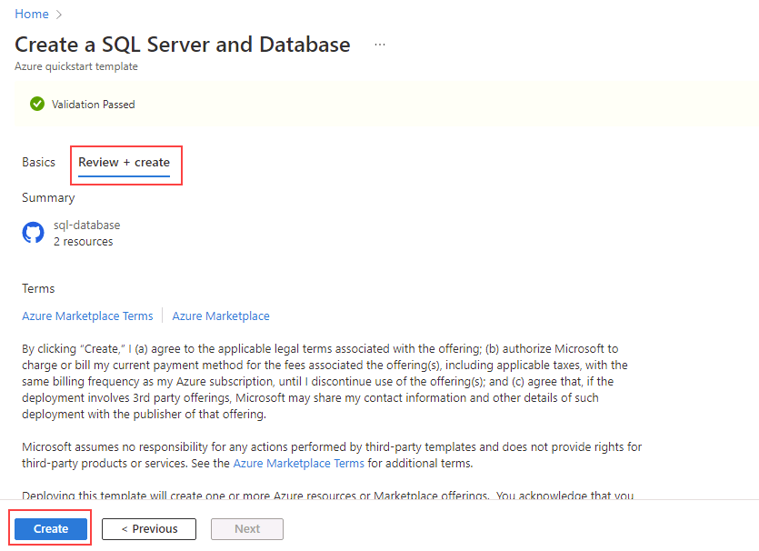

---
lab:
  title: Laboratório 11 – Implantar Banco de Dados SQL do Azure usando um modelo do Azure Resource Manager
  module: Automate database tasks for Azure SQL
---

# Implantar um Banco de Dados SQL do Azure a partir de um modelo

**Tempo estimado**: 15 minutos

Você foi contratado como engenheiro de dados sênior para ajudar a automatizar operações rotineiras de administração do banco de dados. Essa automação serve para ajudar a garantir que os bancos de dados do AdventureWorks continuem operando com o máximo de desempenho e para fornecer métodos para gerar alertas com base em determinados critérios. A AdventureWorks usa o SQL Server em ofertas de IaaS (infraestrutura como serviço) e PaaS (plataforma como serviço).

## Explorar o modelo do Azure Resource Manager

1. No Microsoft Edge, abra uma nova guia e navegue até o caminho a seguir em um repositório GitHub, que contém um modelo do ARM para implantar um recurso do Banco de Dados SQL

    ```url
    https://github.com/Azure/azure-quickstart-templates/tree/master/quickstarts/microsoft.sql/sql-database
    ```

1. Clique com o botão direito do mouse em **azuredeploy.json** e selecione **Abrir link em nova guia** para exibir o modelo do ARM, que deve ser semelhante a este:

    ```JSON
    {
    "$schema": "https://schema.management.azure.com/schemas/2019-04-01/deploymentTemplate.json#",
    "contentVersion": "1.0.0.0",
    "parameters": {
        "serverName": {
        "type": "string",
        "defaultValue": "[uniqueString('sql', resourceGroup().id)]",
        "metadata": {
            "description": "The name of the SQL logical server."
        }
        },
        "sqlDBName": {
        "type": "string",
        "defaultValue": "SampleDB",
        "metadata": {
            "description": "The name of the SQL Database."
        }
        },
        "location": {
        "type": "string",
        "defaultValue": "[resourceGroup().location]",
        "metadata": {
            "description": "Location for all resources."
        }
        },
        "administratorLogin": {
        "type": "string",
        "metadata": {
            "description": "The administrator username of the SQL logical server."
        }
        },
        "administratorLoginPassword": {
        "type": "securestring",
        "metadata": {
            "description": "The administrator password of the SQL logical server."
        }
        }
    },
    "variables": {},
    "resources": [
        {
        "type": "Microsoft.Sql/servers",
        "apiVersion": "2020-02-02-preview",
        "name": "[parameters('serverName')]",
        "location": "[parameters('location')]",
        "properties": {
            "administratorLogin": "[parameters('administratorLogin')]",
            "administratorLoginPassword": "[parameters('administratorLoginPassword')]"
        },
        "resources": [
            {
            "type": "databases",
            "apiVersion": "2020-08-01-preview",
            "name": "[parameters('sqlDBName')]",
            "location": "[parameters('location')]",
            "sku": {
                "name": "Standard",
                "tier": "Standard"
            },
            "dependsOn": [
                "[resourceId('Microsoft.Sql/servers', concat(parameters('serverName')))]"
            ]
            }
        ]
        }
    ]
    }
    ```

1. Revise e observe as propriedades JSON.

1. Feche a guia do **azuredeploy.json** e retorne à guia que contém a pasta **sql-database** do GitHub. Role para baixo e selecione **Implantar no Azure**.

    

1. A página do modelo de início rápido **Criar um SQL Server e Banco de Dados** será aberta no portal do Azure, com os detalhes do recurso parcialmente preenchidos a partir do modelo do ARM. Preencha os campos em branco com as informações abaixo:

    - **Grupo de recursos:** começando com *contoso-rg*
    - **Logon do Administrador SQL:** labadmin
    - **Senha de logon do Administrador SQL:**&lt;insira uma senha forte&gt;

1. Selecione **Examinar + Criar** e, em seguida, selecione **Criar**. Sua implantação levará em torno de cinco minutos para ser realizada.

    

1. Quando a implantação for concluída, selecione **Ir para grupo de recursos**. Você será direcionado para o Grupo de Recursos do Azure, que contém um recurso do **SQL Server** nomeado aleatoriamente e criado pela implantação.

    

---

## Recursos de limpeza

Se você não estiver usando o SQL Server do Azure para nenhuma outra finalidade, poderá limpar os recursos criados neste laboratório.

### Excluir o Grupo de Recursos

Se você criou um novo grupo de recursos para este laboratório, poderá excluir o grupo de recursos para remover todos os recursos criados neste laboratório.

1. No portal do Azure, selecione **Grupos de recursos** no painel de navegação esquerdo ou pesquise **Grupos de recursos** na barra de pesquisa e selecione-o nos resultados.

1. Vá para o grupo de recursos criado para o laboratório. O grupo de recursos conterá o SQL Server do Azure e outros recursos criados neste laboratório.

1. Selecione **Excluir grupo de recursos** no menu superior.

1. Na caixa de diálogo **Excluir grupo de recursos**, digite o nome do grupo para confirmar e clique em **Excluir**.

1. Aguarde até que o grupo de recursos seja excluído.

1. Feche o portal do Azure.

### Excluir apenas os recursos do laboratório

Se você não criou um novo grupo de recursos para este laboratório e deseja deixar o grupo de recursos e seus recursos anteriores intactos, ainda poderá excluir os recursos criados neste laboratório.

1. No portal do Azure, selecione **Grupos de recursos** no painel de navegação esquerdo ou pesquise **Grupos de recursos** na barra de pesquisa e selecione-o nos resultados.

1. Vá para o grupo de recursos criado para o laboratório. O grupo de recursos conterá o SQL Server do Azure e outros recursos criados neste laboratório.

1. Selecione todos os recursos prefixados com o nome do SQL Server especificado anteriormente no laboratório.

1. Selecione **Excluir** no menu superior.

1. Na caixa de diálogo **Excluir recursos**, digite **excluir** e selecione **Excluir**.

1. Para confirmar a exclusão dos recursos, clique em excluir novamente **Excluir**.

1. Aguarde a exclusão dos recursos.

1. Feche o portal do Azure.

---

Você concluiu este laboratório.

Você acabou de ver como, com um único clique no link de um modelo do Azure Resource Manager, você pode criar facilmente um banco de dados e um servidor SQL do Azure.
