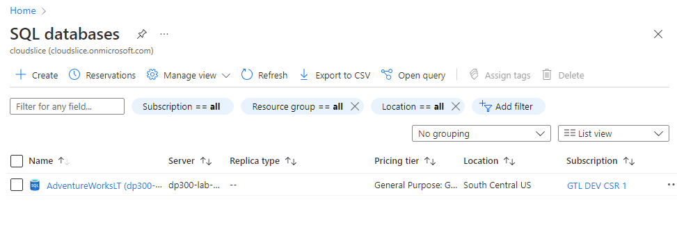
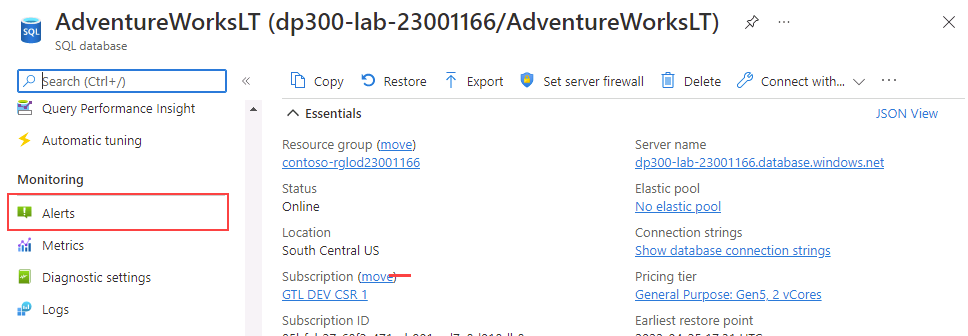
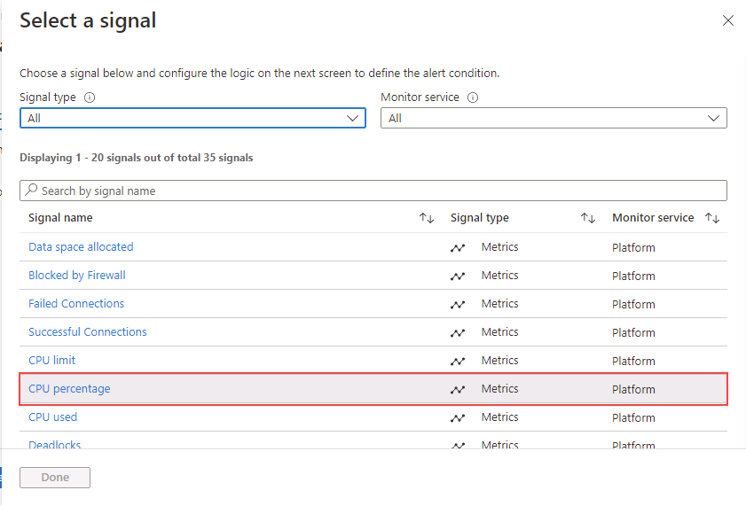

---
lab:
  title: 'Laboratório 12: criar um alerta de status de CPU para um SQL Server'
  module: Automate database tasks for Azure SQL
---

# Criar um alerta de status de CPU para um SQL Server no Azure

**Tempo estimado**: 30 minutos

Você foi contratado como Engenheiro de Dados Sênior para ajudar a automatizar operações diárias de administração do banco de dados. Essa automação foi criada para ajudar a garantir que os bancos de dados do AdventureWorks continuem operando com desempenho máximo, bem como fornecendo métodos para gerar alertas com base em determinados critérios.

**Observação:** Esses exercícios podem solicitar que você copie e cole código T-SQL e use recursos SQL existentes. Verifique se o código foi copiado corretamente antes de executá-lo.

## Criar um alerta quando uma CPU exceder a média de 80 por cento

1. Na barra de pesquisa na parte superior do portal do Azure, digite **SQL** e clique em **Banco de dados SQL**. Selecione o nome do banco de dados **AdventureWorksLT** listado.

    

1. No painel principal do banco de dados **AdventureWorksLT**, navegue até a seção de monitoramento. Selecione **Alertas**.

    

1. Selecione **Criar regra de alerta**.

    

1. No slide **Selecionar um sinal**, selecione a **Porcentagem da CPU**.

    

1. No slide **Configurar sinal**, selecione **Estático** para a propriedade **Limite**. Em seguida, verifique se a propriedade **Operador** é **Maior que** e o tipo de **Agregação** é **Média**. Em seguida, em **Valor limite**, insira um valor de **80**. Selecione **Concluído**.

    

1. Selecione a guia **Ações**.

    

1. Na guia **Ações**, selecione **Criar grupo de ações**.

    

1. Na tela **Grupo de ações**, digite **grupo_de_email** no campo **Nome do grupo de ações** e selecione **Avançar: Notificações**.

    

1. Na guia **Notificações**, insira as seguintes informações:

    - **Tipo de notificação:** Email/Mensagem SMS/Push/Voz
        - **Observação:** Ao selecionar essa opção, um submenu com as opções Email/SMS/Push/Voz será exibido. Verifique a propriedade Email e digite o nome de usuário do Azure com o qual você entrou.
    - **Nome:** DemoLab

    

1. Selecione **Examinar + criar**e **Criar**.

    

    **Observação:** Antes de selecionar **Criar**, você também pode selecionar **Testar grupo de ações (versão prévia)** para testar o Alerta.

1. Um email como esse é enviado para o endereço de email que você inseriu, assim que a regra é criada.

    

    Com o alerta em vigor, se o uso da CPU exceder a média de 80%, um email como este será enviado.

    

Os alertas podem enviar um email ou chamar um webhook quando alguma métrica (por exemplo, tamanho do banco de dados ou uso da CPU) atingir um limite definido. Você acabou de ver como é possível configurar alertas facilmente para bancos de dados SQL do Azure.
