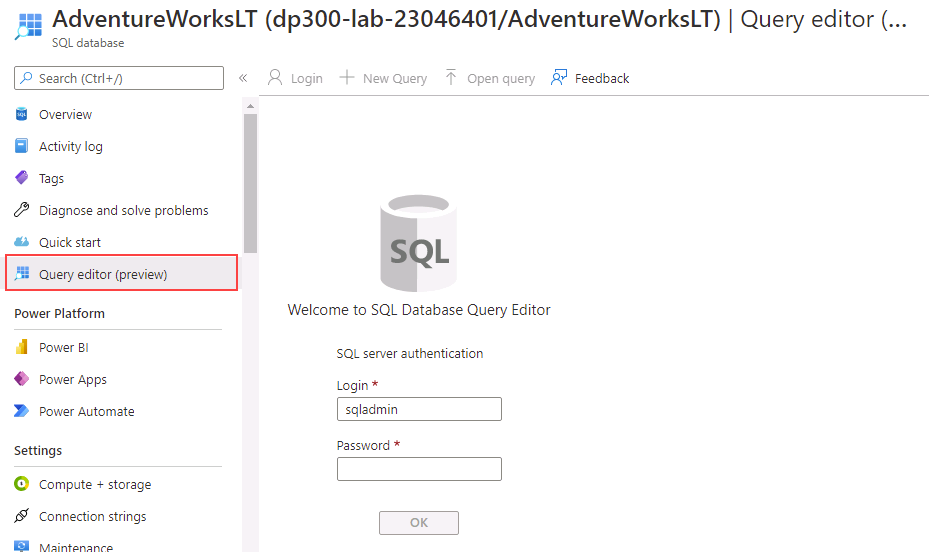
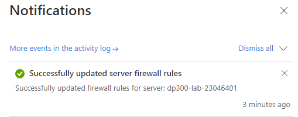
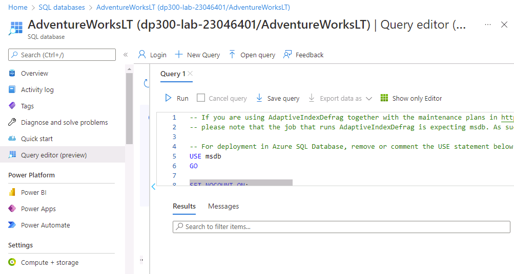
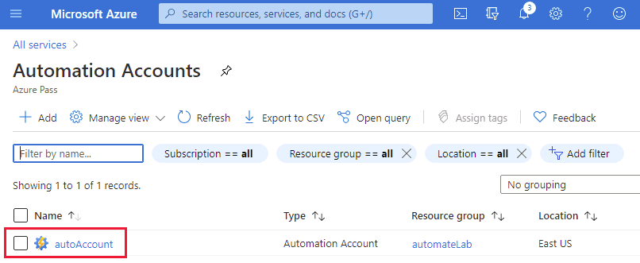
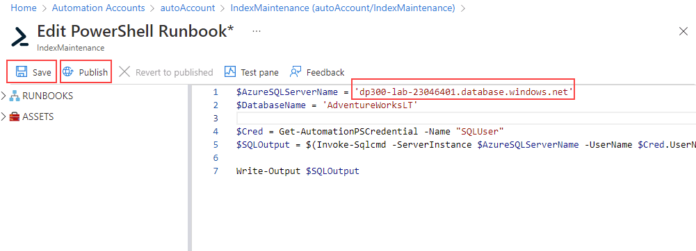
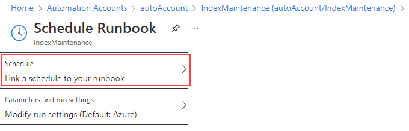
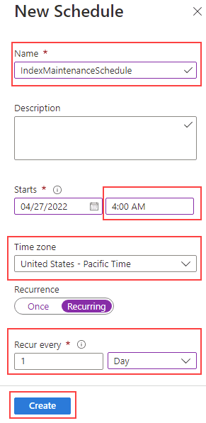

---
lab:
  title: 'Laboratório 13: implantar um runbook de automação para recompilar índices de modo automático'
  module: Automate database tasks for Azure SQL
---

# Implantar um runbook de automação para recompilar índices de modo automático

**Tempo estimado**: 30 minutos

Você foi contratado como Administrador de Banco de Dados Sênior para ajudar a automatizar operações rotineiras de administração do banco de dados. Essa automação foi criada para ajudar a garantir que os bancos de dados do AdventureWorks continuem operando com desempenho máximo, bem como fornecendo métodos para gerar alertas com base em determinados critérios. O AdventureWorks usa o SQL Server em ofertas de Infraestrutura como Serviço (IaaS) e Plataforma como Serviço (PaaS).

**Observação:** Esses exercícios podem solicitar que você copie e cole código T-SQL e use recursos SQL existentes. Verifique se o código foi copiado corretamente antes de executá-lo.

## Criar uma Conta de Automação

1. Na máquina virtual do laboratório, inicie uma sessão do navegador e navegue até [https://portal.azure.com](https://portal.azure.com/). Conecte-se ao Portal usando o **Nome de usuário** e a **Senha** do Azure fornecidos na guia **Recursos** desta máquina virtual de laboratório.

    

1. No portal do Azure, digite *automação* na barra de pesquisa, escolha **Contas de Automação** nos resultados da pesquisa e, em seguida, selecione **+Criar**.

    

1. Na página **Criar uma Conta de Automação**, insira as informações abaixo e selecione **Examinar + Criar**.

    - **Grupo de recursos:** &lt;Seu grupo de recursos&gt;
    - **Nome:** autoAccount
    - **Localização:** Use o padrão.

    

1. Na página Examinar, selecione **Criar**.

    

    > [!NOTE]
    > Sua conta de automação deverá ser criada em até três minutos.

## Conectar-se a um Banco de Dados SQL do Azure existente

1. No portal do Azure, navegue até o banco de dados pesquisando por **bancos de dados SQL**.

    

1. Selecione o banco de dados SQL **AdventureWorksLT**.

    

1. Na seção principal da página do Banco de Dados SQL, selecione **Editor de Consultas (versão prévia)**.

    

1. Você será solicitado a fornecer credenciais para entrar no banco de dados. Use esta credencial:

    - **Logon:** sqladmin
    - **Senha**: P@ssw0rd01

1. Você deve receber a seguinte mensagem de erro:

    

1. Selecione o link **IP da lista de permissões ...** fornecido no final da mensagem de erro mostrada acima. Isso adicionará automaticamente o IP do cliente como uma entrada de regra de firewall para o seu Banco de Dados SQL.

    

1. Retorne ao Editor de consultas e selecione **OK** para entrar no banco de dados.

1. Abra uma guia no navegador e navegue até a página do GitHub para acessar o script [**AdaptativeIndexDefragmentation**](https://github.com/microsoft/tigertoolbox/blob/master/AdaptiveIndexDefrag/usp_AdaptiveIndexDefrag.sql). Depois, selecione **Bruto**.

    

    Isso fornecerá o código em um formato em que será possível copiá-lo. Selecione todo o texto (<kbd>CTRL</kbd> + <kbd>A</kbd>) e copie-o para a área de transferência (<kbd>CTRL</kbd> + <kbd>C</kbd>).

    >[!NOTE]
    > A finalidade desse script é executar uma desfragmentação inteligente em um ou mais índices, bem como a atualização das estatísticas necessárias, para um ou mais bancos de dados.

1. Feche a guia do navegador do GitHub e retorne ao portal do Azure.

1. Cole o texto copiado no painel da **Consulta 1**.

    

1. Exclua `USE msdb` e `GO` nas linhas 5 e 6 da consulta (que estão realçadas na captura de tela), depois clique em **Executar**.

1. Expanda a pasta **Procedimentos Armazenados** para conferir o que foi criado.

    

## Configurar ativos da Conta de Automação

As próximas etapas consistem em configurar os ativos necessários na preparação para a criação do runbook. Depois selecione **Contas de Automação**.

1. No portal do Azure, digite **automação** na caixa de pesquisa da parte superior da página.

    

1. Selecione a conta de automação criada.

    

1. Selecione **Módulos** na seção de **Recursos Compartilhados** da folha de Automação. Em seguida, selecione **Procurar na galeria**.

    

1. Pesquise o módulo **sqlserver** na Galeria.

    

1. Selecione **SqlServer**, o que o direcionará para a próxima tela, e selecione **Selecionar**.

    

1. Na página **Adicionar um módulo**, escolha a versão de runtime mais recente disponível e selecione **Importar**. Isso importará o módulo do PowerShell para sua Conta de Automação.

    

1. Será preciso criar uma credencial para entrar com segurança no banco de dados. Na folha Conta de Automação, navegue até a seção **Recursos Compartilhados** e selecione **Credenciais**.

    

1. Selecione **+ Adicionar uma Credencial**, insira as informações abaixo e selecione **Criar**.

    - Nome: **SQLUser**
    - Nome de usuário: **sqladmin**
    - Senha: **P@ssw0rd01**
    - Confirmar senha: **P@ssw0rd01**

    

## Criar runbook do PowerShell

1. No portal do Azure, navegue até o banco de dados pesquisando por **bancos de dados SQL**.

    

1. Selecione o banco de dados SQL **AdventureWorksLT**.

    

1. Na página **Visão Geral**, copie o **Nome do servidor** do Banco de Dados SQL do Azure conforme mostrado abaixo (o nome do seu servidor deve começar com *dp300-lab*). Você colará essa informação nas próximas etapas.

    

1. No portal do Azure, digite **automação** na caixa de pesquisa da parte superior da página.

    

1. Selecione a conta de automação criada.

    

1. Role até a seção de **Automação do Processo** da folha Conta de Automação, selecione **Runbooks** e depois **+ Criar um runbook**.

    

    >[!NOTE]
    > Como aprendemos, observe que existem dois runbooks já criados. Eles foram criados automaticamente durante a implantação da conta de automação.

1. Digite o nome do runbook como **IndexMaintenance** e um tipo de runbook do **PowerShell**. Escolha a versão de runtime mais recente disponível e, em seguida, selecione **Criar**.

    

1. Assim que o runbook for criado, copie e cole o snippet de código do PowerShell abaixo no seu editor de runbook. Na primeira linha do script, cole o nome do servidor copiado nas etapas acima. Selecione **Salvar** e depois **Publicar**.

    **Observação:** Verifique se o código foi copiado corretamente antes de salvar o runbook.

    ```powershell
    $AzureSQLServerName = ''
    $DatabaseName = 'AdventureWorksLT'
    
    $Cred = Get-AutomationPSCredential -Name "SQLUser"
    $SQLOutput = $(Invoke-Sqlcmd -ServerInstance $AzureSQLServerName -UserName $Cred.UserName -Password $Cred.GetNetworkCredential().Password -Database $DatabaseName -Query "EXEC dbo.usp_AdaptiveIndexDefrag" -Verbose) 4>&1

    Write-Output $SQLOutput
    ```

    

1. Se tudo correr bem, você deverá receber uma mensagem de operação bem-sucedida.

    

## Criar um agendamento para o runbook

Em seguida, você criará um agendamento para o runbook ser executado de modo regular.

1. Em **Recursos** na navegação à esquerda do runbook **IndexMaintenance**, selecione **Agendamentos**. Depois clique em **+Adicionar um agendamento**.

    

1. Selecione **Vincular um agendamento ao runbook**.

    

1. Selecione **+ Adicionar um agendamento**.

    

1. Forneça um nome descritivo para o agendamento e uma descrição, se desejado.

1. Especifique o horário de início às **04:00** da manhã do dia seguinte no fuso horário do **Pacífico**. Configure a recorrência para executar a cada **1** dia. Não defina uma data de término.

    

1. Clique em **Criar**, depois em **OK**.

1. O agendamento agora está criado e vinculado ao runbook. Selecione **OK**.

    

A Automação do Azure oferece um serviço de configuração e automação baseado em nuvem que dá suporte ao gerenciamento consistente em seus ambientes Azure e não Azure.

Ao concluir este exercício, você automatizou a desfragmentação de índices em um banco de dados do SQL Server para ser executada todos os dias às 4h da manhã.