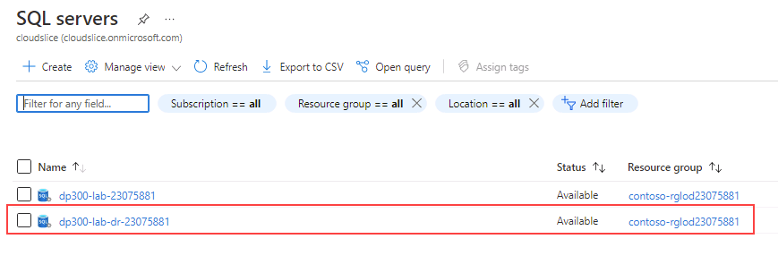
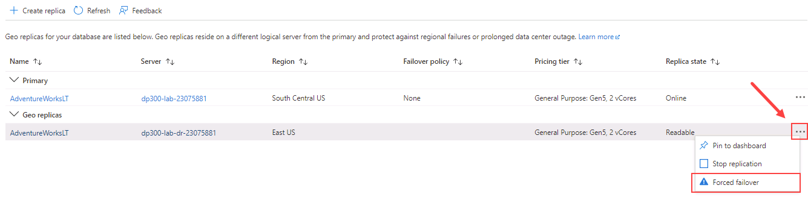
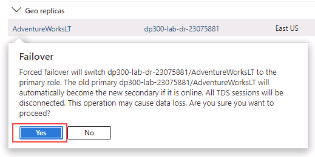

---
lab:
  title: 'Laboratório: configurar a replicação geográfica para o Banco de Dados SQL do Azure'
  module: Plan and implement a high availability and disaster recovery solution
---

# Laboratório: configurar a replicação geográfica para o Banco de Dados SQL do Azure

**Tempo estimado**: 20 minutos

Como DBA no AdventureWorks, você precisa habilitar a replicação geográfica para o Banco de Dados SQL do Azure e garantir que ele esteja funcionando corretamente. Além disso, você fará failover manualmente para outra região usando o portal.

## Habilitar a replicação geográfica

1. Na máquina virtual do laboratório, inicie uma sessão do navegador e navegue até [https://portal.azure.com](https://portal.azure.com/). Conecte-se ao Portal usando o Nome** de Usuário e **a Senha** do Azure **fornecidos na **guia Recursos** para esta máquina virtual de laboratório.

    

1. No portal do Azure, navegue de volta para o banco de dados pesquisando por **bancos de dados SQL**.

    

1. Selecione o banco de dados **SQL AdventureWorksLT.**

    

1. Na folha do banco de dados, em **Gerenciamento de dados**, selecione **Réplicas**.

    

1. Selecione **Criar réplica**.

    

1. Na página **Criar Banco de Dados SQL – Réplica geográfica** e, em **Servidor**, selecione **Criar**.

    

    >[!NOTE]
    > Como estamos criando um novo servidor para hospedar nosso banco de dados secundário, podemos ignorar a mensagem de erro acima.

1. **Na página Criar Servidor** do Banco de Dados SQL, insira um nome** de servidor exclusivo **de sua preferência, um logon** de administrador de servidor válido **e uma senha** segura**. Selecione um **local** como a região de destino e, em seguida, selecione **OK** para criar o servidor.

    

1. De volta à **página Criar Banco de Dados SQL - Réplica Geográfica** , selecione **Revisar + Criar**.

    

1. Selecione **Criar**.

    

1. O servidor secundário e o banco de dados serão criados agora. Para verificar o status, examine o ícone de sino na parte superior do portal. 

    

1. Se a criação tiver ocorrido com sucesso, ele mudará de **Implantação em andamento** para **Implantação bem-sucedida**.

    

## Banco de dados SQL para região secundária

Agora que a réplica do Banco de Dados SQL do Azure foi criada, você fará um failover.

1. Navegue até a página SQL servers e observe o novo servidor na lista. Selecione o servidor secundário (você pode ter um nome de servidor diferente).

    

1. Na folha do SQL Server, na **seção Configurações** , selecione **Bancos de dados** SQL.

    

1. Na folha do banco de dados, em **Gerenciamento de dados**, selecione **Réplicas**.

    

1. Observe que o link de replicação geográfica agora está estabelecido.

    

1. Selecione o menu **...** do servidor secundário e clique em **Failover Forçado**.

    

    > [!NOTE]
    > O failover forçado alternará o banco de dados secundário para a função principal. Todas as sessões são desconectadas durante esta operação.

1. Quando solicitado pela mensagem de aviso, clique em **Sim**.

    

1. O status da réplica primária será alternado para **Pendente** e o status da secundária para **Failover**. 

    

    > [!NOTE]
    > Esse processo pode levar alguns minutos. Após a conclusão, as funções serão alternadas quando o secundário se tornar o novo primário e o primário anterior se tornar o secundário.

O banco de dados secundário legível pode estar na mesma região do Azure que o primário ou, mais comumente, em uma diferente. Esse tipo de banco de dados secundário legível também é conhecido como secundários geográficos ou réplicas geográficas.

Você aprendeu a habilitar a replicação geográfica para o banco de dados SQL do Azure, verificar se ela está funcionando e fazer o failover manual para outra região usando o portal.
