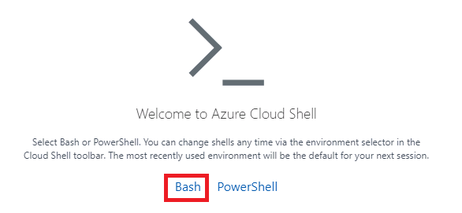
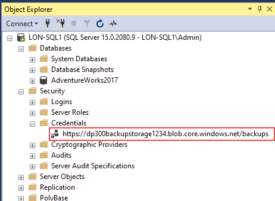
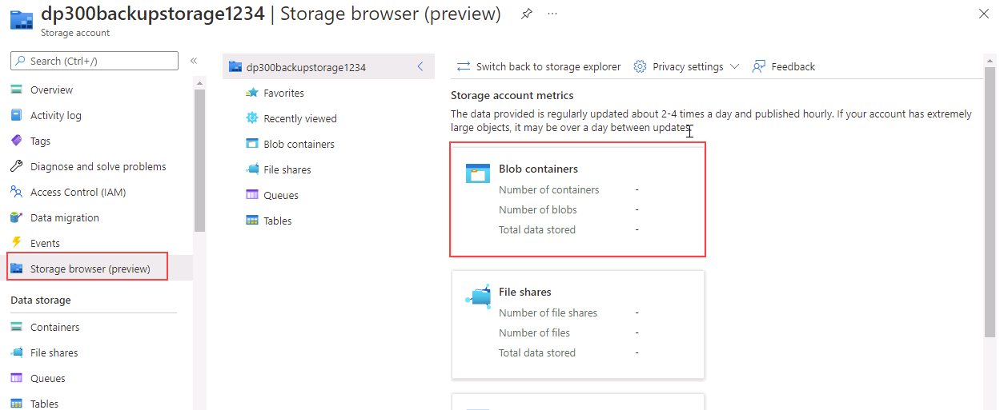
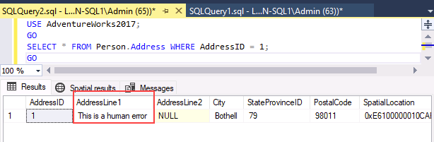

---
lab:
  title: Laboratório 15 – fazer backup para URL e restaurar da URL
  module: Plan and implement a high availability and disaster recovery solution
---

# Backup para a URL

**Tempo estimado**: 30 minutos

Como DBA da AdventureWorks, você precisa fazer backup de um banco de dados para um URL no Azure e restaurá-lo do Armazeno de Blobs do Azure após a ocorrência de um erro humano.

## Restaurar um banco de dados

1. Faça download do arquivo de backup localizado no **https://github.com/MicrosoftLearning/dp-300-database-administrator/blob/master/Instructions/Templates/AdventureWorks2017.bak** para o caminho **C:\LabFiles\HADR** na VM do laboratório (crie a estrutura de pastas, se ainda não existir).

    

1. Selecione o botão Iniciar do Windows e digite SSMS. Selecione **Microsoft SQL Server Management Studio 18** na lista.  

    

1. Quando o SSMS for aberto, observe que a caixa de diálogo **Conectar ao Servidor** será pré-preenchida com o nome de instância padrão. Selecione **Conectar**.

    

1. Selecione a pasta**Bancos de Dados** e **Nova Consulta**.

    

1. Na janela Nova consulta, copie e cole o T-SQL abaixo. Execute a consulta para restaurar o banco de dados.

    ```sql
    RESTORE DATABASE AdventureWorks2017
    FROM DISK = 'C:\LabFiles\HADR\AdventureWorks2017.bak'
    WITH RECOVERY,
          MOVE 'AdventureWorks2017' 
            TO 'C:\LabFiles\HADR\AdventureWorks2017.mdf',
          MOVE 'AdventureWorks2017_log'
            TO 'C:\LabFiles\HADR\AdventureWorks2017_log.ldf';
    ```

    **Observação:** o nome e o caminho do arquivo de backup do banco de dados devem corresponder ao que você baixou na etapa 1, caso contrário, o comando falhará.

1. Uma mensagem de sucesso será exibida após a conclusão da restauração.

    

## Configurar o backup da URL

1. Na máquina virtual do laboratório, inicie uma sessão do navegador e navegue até [https://portal.azure.com](https://portal.azure.com/). Conecte-se ao Portal usando o **Nome de usuário** e a **Senha** do Azure fornecidos na guia **Recursos** desta máquina virtual de laboratório.

    

1. Abra um prompt do **Cloud Shell** selecionando o ícone mostrado abaixo.

    

1. Na metade inferior do portal, você talvez veja uma mensagem de boas-vindas ao Azure Cloud Shell, caso ainda não tenha usado esse serviço. Selecione **Bash**.

    

1. Se você nunca usou um Cloud Shell, deve configurar um armazenamento. Selecione **Mostrar configurações avançadas** (você pode ter uma assinatura diferente atribuída).

    

1. Use o **Grupo de recursos** existente e especifique novos nomes para a **Conta de armazenamento** e o **Compartilhamento de arquivos**, conforme mostrado na caixa de diálogo abaixo. Anote o nome do **Grupo de recursos**. Deve começar com *contoso-rg*. Em seguida, selecione **Criar armazenamento**.

    **Observação:** o nome da conta de armazenamento deve ser exclusivo e ter todas as letras minúsculas sem caracteres especiais. Forneça um nome exclusivo.

    

1. Após a conclusão, você verá um prompt semelhante ao mostrado abaixo. Verifique se o canto superior esquerdo da tela do Cloud Shell mostra **Bash**.

    

1. Crie uma conta de armazenamento pela CLI executando o comando a seguir no Cloud Shell. Use o nome do grupo de recursos começando com **contoso-rg** que você anotou acima.

    > [!NOTE]
    > Altere o nome do grupo de recursos (parâmetro **-g**) e forneça um nome de conta de armazenamento exclusivo (parâmetro **-n**).

    ```bash
    az storage account create -n "dp300backupstorage1234" -g "contoso-rglod23149951" --kind StorageV2 -l eastus2
    ```

    

1. Em seguida, você obterá as chaves da sua conta de armazenamento, que usará nas etapas seguintes. Execute o seguinte código no Cloud Shell usando o nome exclusivo da sua conta de armazenamento e grupo de recursos.

    ```bash
    az storage account keys list -g contoso-rglod23149951 -n dp300backupstorage1234
    ```

    Sua chave de conta estará nos resultados do comando acima. Use o mesmo nome (após o **-n**) e o grupo de recursos (após o **-g**) que você usou no comando anterior. Copie o valor retornado para **key1** (sem as aspas duplas), conforme mostrado aqui:

    

1. O backup de um banco de dados no SQL Server para uma URL usa um contêiner em uma conta de armazenamento. Você criará um contêiner especificamente para armazenamento de backup nessa etapa. Para fazer isso, execute os comandos abaixo.

    ```bash
    az storage container create --name "backups" --account-name "dp300backupstorage1234" --account-key "storage_key" --fail-on-exist
    ```

    Em que **dp300backupstorage1234** é o nome da conta de armazenamento exclusivo usado ao criar essa conta e **storage_key** é a chave gerada acima. A saída deve retornar **true**.

    

1. Para verificar se os backups de contêiner foram criados corretamente, execute:

    ```bash
    az storage container list --account-name "dp300backupstorage1234" --account-key "storage_key"
    ```

    Em que **dp300backupstorage1234** é o nome da conta de armazenamento exclusivo usado ao criar essa conta e **storage_key** é a chave gerada. A saída deve retornar algo semelhante ao mostrado abaixo:

    

1. Uma SAS (assinatura de acesso compartilhado) no nível de contêiner é necessária para segurança. Isso pode ser feito por meio do Cloud Shell ou do PowerShell. Execute a seguinte consulta:

    ```bash
    az storage container generate-sas -n "backups" --account-name "dp300backupstorage1234" --account-key "storage_key" --permissions "rwdl" --expiry "date_in_the_future" -o tsv
    ```

    Em que **dp300backupstorage1234** é o nome da conta de armazenamento exclusivo usado ao criar essa conta, **storage_key** é a chave gerada e **date_in_the_future** é um momento posterior ao atual. **date_in_the_future** deve estar em UTC. Um exemplo é **2021-12-31T00:00Z**, que significa a expiração em 31 de dezembro de 2020 à meia-noite.

    A saída deve retornar algo semelhante ao mostrado abaixo. Copie toda a Assinatura de Acesso Compartilhado e cole-a no **Bloco de notas**, pois ela será usada na próxima tarefa.

    

## Criar credencial

Agora que a funcionalidade está configurada, você pode gerar um arquivo de backup como um blob na conta de armazenamento do Azure.

1. Inicie o **SSMS (SQL Server Management Studio)**.

1. Será exibida uma mensagem pedindo que você se conecte ao SQL Server. Verifique se a **Autenticação do Windows** está selecionada e escolha **Conectar**.

1. Selecione **Nova Consulta**.

1. Crie a credencial que será usada para acessar o armazenamento na nuvem com o Transact-SQL a seguir. Preencha os valores apropriados e selecione **Executar**.

    ```sql
    IF NOT EXISTS  
    (SELECT * 
        FROM sys.credentials  
        WHERE name = 'https://<storage_account_name>.blob.core.windows.net/backups')  
    BEGIN
        CREATE CREDENTIAL [https://<storage_account_name>.blob.core.windows.net/backups]
        WITH IDENTITY = 'SHARED ACCESS SIGNATURE',
        SECRET = '<key_value>'
    END;
    GO  
    ```

    Em que as duas ocorrências de **<storage_account_name>** são o nome da conta de armazenamento exclusivo criado e **<key_value>** é o valor gerado no final da tarefa anterior neste formato:

    `'se=2020-12-31T00%3A00Z&sp=rwdl&sv=2018-11-09&sr=csig=rnoGlveGql7ILhziyKYUPBq5ltGc/pzqOCNX5rrLdRQ%3D'`

1. Para verificar se a credencial foi criada corretamente, vá até **Segurança -> Credenciais** no Pesquisador de Objetos.

    

1. Se você digitou algo incorretamente e precisa recriar a credencial, use o seguinte comando para corrigir o valor digitado, lembrando-se de alterar o nome da conta de armazenamento:

    ```sql
    -- Only run this command if you need to go back and recreate the credential! 
    DROP CREDENTIAL [https://<storage_account_name>.blob.core.windows.net/backups]  
    ```

## Backup para a URL

1. Faça backup do banco de dados **AdventureWorks2017** no Azure com o seguinte comando no Transact-SQL:

    ```sql
    BACKUP DATABASE AdventureWorks2017   
    TO URL = 'https://<storage_account_name>.blob.core.windows.net/backups/AdventureWorks2017.bak';
    GO 
    ```

    Em que **<storage_account_name>** é o nome da conta de armazenamento exclusivo usado ao criá-la. A saída deve retornar algo semelhante ao mostrado abaixo.

    

    Se algo foi configurado incorretamente, você verá uma mensagem de erro semelhante à seguinte:

    

    Se ocorrer um erro, verifique se você não digitou algo incorretamente durante a criação da credencial, e se tudo foi criado com êxito.

## Validar o backup por meio da CLI do Azure

Para ver se o arquivo está realmente no Azure, você pode usar Gerenciador de Armazenamento (versão prévia) ou o Azure Cloud Shell.

1. Abra um navegador da Web e navegue até [https://portal.azure.com](https://portal.azure.com/). Conecte-se ao Portal usando o **Nome de Usuário** e a **Senha** do Azure fornecidos na guia **Recursos** dessa máquina virtual do laboratório.

1. Use o Azure Cloud Shell para executar este comando da CLI do Azure:

    ```bash
    az storage blob list -c "backups" --account-name "dp300backupstorage1234" --account-key "storage_key" --output table
    ```

    Certifique-se de usar o mesmo nome da conta de armazenamento exclusivo (após **--account-name**) e a chave da conta (após **--account-key**) usados nos comandos anteriores.

    

    Podemos confirmar que o arquivo de backup foi gerado com sucesso.

## Validar o backup por meio do Gerenciador de Armazenamento

1. Para usar o Gerenciador de Armazenamento (versão prévia), selecione **Contas de armazenamento** na página inicial no portal do Azure.

    

1. Selecione o nome exclusivo da conta de armazenamento que você criou para os backups.

1. No painel de navegação esquerdo, clique em **Navegador de armazenamento (versão prévia)**. Expanda **Contêineres de Blob**.

    

1. Selecione **Backups**.

    

1. Observe que o arquivo de backup é armazenado no contêiner.

    

## Restauração a partir da URL

Esta tarefa mostrará como restaurar um banco de dados a partir de um armazenamento de blob do Azure.

1. No **SSMS (SQL Server Management Studio)**, selecione **Nova Consulta**, em seguida, cole e execute a consulta a seguir.

    ```sql
    USE AdventureWorks2017;
    GO
    SELECT * FROM Person.Address WHERE AddressId = 1;
    GO
    ```

    

1. Execute esse comando para alterar o nome desse cliente.

    ```sql
    UPDATE Person.Address
    SET AddressLine1 = 'This is a human error'
    WHERE AddressId = 1;
    GO
    ```

1. Execute novamente a **Etapa 1** para verificar se o endereço foi alterado. Agora, imagine se alguém tivesse alterado milhares ou milhões de linhas sem uma cláusula WHERE – ou com a cláusula WHERE errada. Uma das soluções envolve a restauração do banco de dados a partir do último backup disponível.

    

1. Para restaurar o banco de dados de modo que ele volte para como estava antes de o nome do cliente ter sido alterado por engano, execute o seguinte.

    **Observação:** a sintaxe **SET SINGLE_USER WITH ROLLBACK IMMEDIATE** reverterá todas as transações abertas. Isso pode evitar que a restauração falhe devido a conexões ativas.

    ```sql
    USE [master]
    GO

    ALTER DATABASE AdventureWorks2017 SET SINGLE_USER WITH ROLLBACK IMMEDIATE
    GO

    RESTORE DATABASE AdventureWorks2017 
    FROM URL = 'https://<storage_account_name>.blob.core.windows.net/backups/AdventureWorks2017.bak'
    GO

    ALTER DATABASE AdventureWorks2017 SET MULTI_USER
    GO
    ```

    Onde **<storage_account_name>** é o nome exclusivo da conta de armazenamento que você criou.

    A saída deve ser semelhante a esta:

    

1. Execute novamente a **Etapa 1** para verificar se o nome do cliente foi restaurado.

    

É importante entender os componentes e a interação para fazer um backup ou uma restauração no serviço de Armazenamento de Blobs do Azure.

Agora você viu que pode fazer backup de um banco de dados para uma URL no Azure e, se necessário, restaurá-lo.
